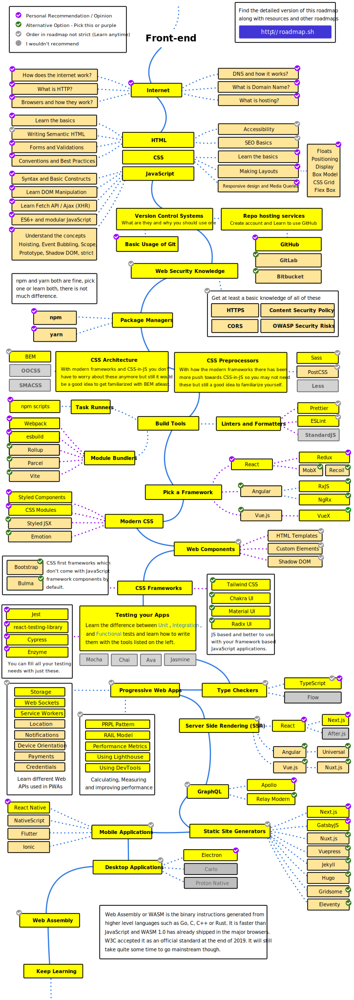
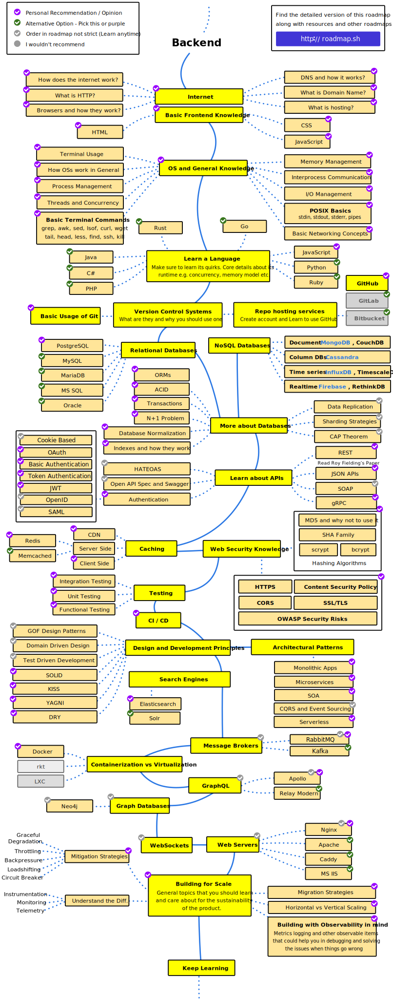
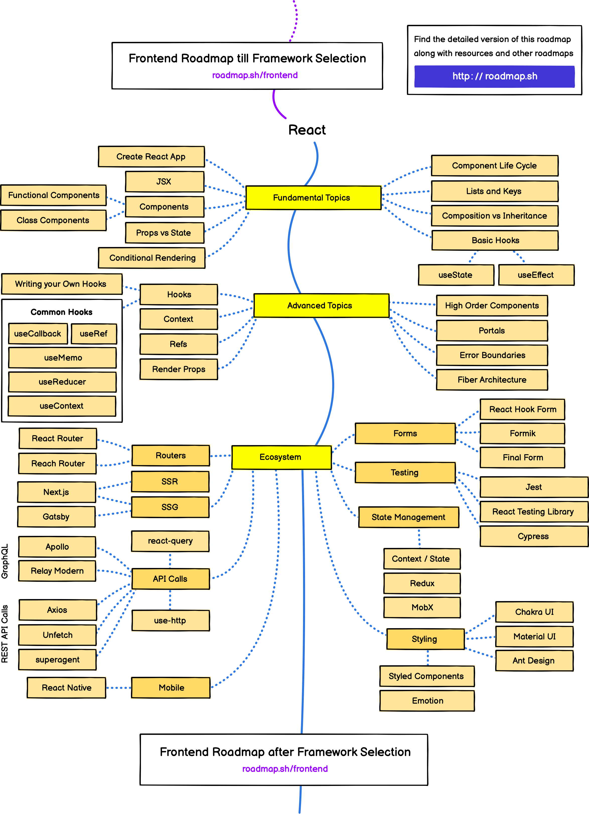
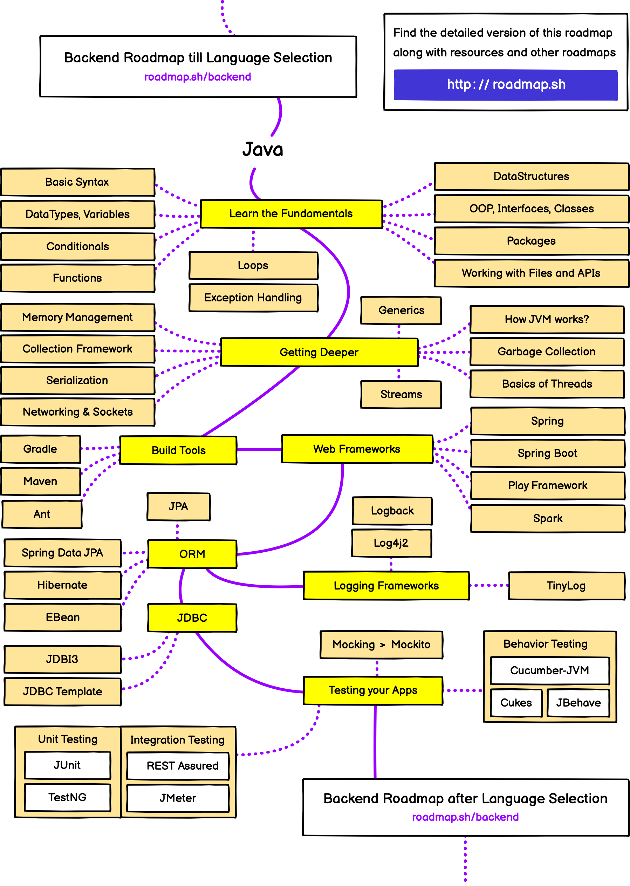

# 简介 :id=introduction

---

> [!TIP]
> ❤️🧡💛💚💙💜**欢迎来到 Uncle Kaimo's Cabin - 凯默叔叔的小屋**💜💙💚💛🧡❤️。 
>  
> 为了方便查阅学习资料以及更直观的看到前端各方面的知识点，我搭建了自己的小屋博客。 
> 主要内容涉及如下：
> 1. 收录前端不错的文章资源等
> 2. 收录开发、创作需要的工具等
> 3. 收录博客/大牛、技术团队、小册、视频等
> 4. 收录自己兴趣方面的资源等
> 
> 

如果觉得写得还不错或对您有帮助，可以投喂[小饼干](/?id=打赏)或者给我的项目点颗星⭐（点击右上角的小猫猫）皮卡皮卡`(*╹▽╹*)`，非常感谢。

---

# Developer Roadmaps :id=developerroadmaps

> [!NOTE]
> [国外最火程序员学习路线：https://github.com/kamranahmedse/developer-roadmap](https://github.com/kamranahmedse/developer-roadmap)

---
<!-- tabs:start -->
### **Frontend**

[https://roadmap.sh/frontend](https://roadmap.sh/frontend)

### **Backend**

[https://roadmap.sh/backend](https://roadmap.sh/backend)

### **DevOps**

[https://roadmap.sh/devops](https://roadmap.sh/devops)

### **React**

[https://roadmap.sh/react](https://roadmap.sh/react)

### **Angular**

[https://roadmap.sh/angular](https://roadmap.sh/angular)

### **Android**

[https://roadmap.sh/android](https://roadmap.sh/android)

### **Python**

[https://roadmap.sh/python](https://roadmap.sh/python)

### **Go**

[https://roadmap.sh/golang](https://roadmap.sh/golang)

### **Java**

[https://roadmap.sh/java](https://roadmap.sh/java)

<!-- tabs:end -->
---

# 前端指南 :id=frontendguide

---

## k00：Html/CSS :id=k00

---
<!-- tabs:start -->
### **CSS相关**

- [CSS-Tricks](https://css-tricks.com/) 一个关于运用CSS技术进行网络开发和设计的小技巧的交流网站
- [Css Wizardry](http://csswizardry.com/) Front-end Architecture and Performance Engineering
- [Sass](http://sass.bootcss.com/docs/sass-reference/) Sass 是成熟、稳定、强大的 CSS 扩展语言
- [Less](http://less.bootcss.com/) 一种将css赋予了动态语言特性的动态样式语言
- [Stylus](http://stylus-lang.com/) EXPRESSIVE, DYNAMIC, ROBUST CSS
- [css modules](https://github.com/css-modules/css-modules)
- [emotion](https://github.com/emotion-js/emotion)
- [CSS Tricks](http://css-tricks.neatbang.com/) CSS技巧收集与演示
- [CSS生成器](https://neumorphism.io/)
- [CSS渐变生成器](https://www.colorzilla.com/gradient-editor/)
- [CSS3-Box Shadow(阴影)](https://www.html.cn/tool/css3Preview/Box-Shadow.html)
- [贝塞尔曲线生成器](https://cubic-bezier.com)
- [花纹背景生成器](http://www.heropatterns.com/)
- [花纹背景-pattern.css](https://github.com/bansal-io/pattern.css)
- [3D字体](https://bennettfeely.com/ztext/)
- [css-tricks](https://css-tricks.com/) css技巧文章
- [You-need-to-know-css](https://lhammer.cn/You-need-to-know-css/#/zh-cn/) CSS的各种DEMO，很全
- [animista](https://animista.net/) CSS动画可视化工具

### **Css && 动画**

- [animate.css](https://github.com/daneden/animate.css) 最有名的动画效果库
- [magic.css](https://github.com/miniMAC/magic) css 动画效果库 类似 animate.css
- [popmotion](https://github.com/Popmotion/popmotion) 一个函数式声明前端动画库
- [NES.css](https://github.com/BcRikko/NES.css) 任天堂主题风格 css 库
- [particles.js](https://github.com/VincentGarreau/particles.js) 前端实现颗粒粒子的动画效果库，比较炫酷，但相对的也比较吃性能
- [PaperCSS](https://www.getpapercss.com/docs/) 手绘风格感觉 css 库
- [rough](https://github.com/pshihn/rough) 基于 Canvas 的手绘风格图形库
- [wired-elements](https://github.com/wiredjs/wired-elements) 基于 rough.js 分装 button input radio 等组件。它的底层是 Web components
- [roughViz](https://github.com/jwilber/roughViz) rough 风格的图表库 手绘风格的图表库
- [matter-js](https://github.com/liabru/matter-js) web 物理引擎
- [micron](https://github.com/webkul/micron) 通过在元素上绑定属性从而实现动画效果的库
- [direction-reveal](https://github.com/NigelOToole/direction-reveal) 根据鼠标进入位置，展现从不同方向 展现 hover 效果
- [laxxx](https://github.com/alexfoxy/laxxx) 滚动特效库 轻量级 压缩完 2kb
- [cssfx](https://cssfx.dev/) 优雅的 CSS 动画效果，开箱即用
- [zdog](https://github.com/metafizzy/zdog) 3D engine 引擎
- [leonsans](https://github.com/cmiscm/leonsans) 酷炫的 字体 动画 geometric sans-serif typeface made with code
- [css-doodle](https://github.com/css-doodle/css-doodle) A web component for drawing patterns with CSS 一个用于使用 CSS 绘制图案的 Web 组件

<!-- tabs:end -->
---
<!-- panels:start -->
<!-- div:left-panel -->
- [强力推荐【张鑫旭：说说CSS学习中的瓶颈】](https://zhuanlan.zhihu.com/p/28870032)
- [css加载会造成阻塞吗](https://segmentfault.com/a/1190000018130499)
- [不可思议的纯 CSS 滚动进度条效果](https://juejin.cn/post/6844903758074216462)
- [CSS实现水平垂直居中的1010种方式（史上最全）](https://juejin.cn/post/6844903679242305544)
- [rem布局解析](https://juejin.cn/post/6844903671143088136)
- [布局的下一次革新](https://juejin.cn/post/6844903666374148103)
- [彻底搞懂word-break、word-wrap、white-space](https://juejin.cn/post/6844903667863126030)
- [彻底搞懂CSS层叠上下文、层叠等级、层叠顺序、z-index](https://juejin.cn/post/6844903667175260174)
- [响应式布局的常用解决方案对比(媒体查询、百分比、rem和vw/vh）](https://github.com/forthealllight/blog/issues/13)
- [深入浅出浏览器中的ES modules](https://github.com/forthealllight/blog/issues/66)
- [前端实现弹幕效果的方法总结(包含css3和canvas的实现方式)](https://github.com/forthealllight/blog/issues/17)
<!-- div:right-panel -->
- [css加载会造成阻塞吗？](https://juejin.cn/post/6844903667733118983)
- [从青铜到王者10个css3伪类使用技巧和运用，了解一哈](https://juejin.cn/post/6844903654756089864)
- [CSS性能优化的8个技巧](https://juejin.cn/post/6844903649605320711)
- [个人总结（css3新特性）](https://juejin.cn/post/6844903518520901639)
- [CSS设置居中的方案总结-超全](https://juejin.cn/post/6844903560879013901)
- [Web开发者需要知道的CSS Tricks](https://juejin.cn/post/6844903576561516558)
- [CSS 常用技巧](https://juejin.cn/post/6844903619909648398)
<!-- panels:end -->
---

## k01：JavaScript :id=k01

---
<!-- panels:start -->
<!-- div:left-panel -->
- [发布订阅模式，在工作中它的能量超乎你的想象](https://juejin.cn/post/6844903616172539917)
- [谁说前端不需要懂-Nginx反向代理与负载均衡](https://juejin.cn/post/6844903619465068551)
- [CSS世界中那些说起来很冷的知识](https://juejin.cn/post/6844903635248218126)
- [WebSocket是时候展现你优秀的一面了](https://juejin.cn/post/6844903696560553991)
- [socket.io让每个人都可以开发属于自己的即时通讯](https://juejin.cn/post/6844903700905852936)
- [WebSocket 是什么原理？为什么可以实现持久连接](https://juejin.cn/post/6844903592525037576)
- [JavaScript 如何工作：对引擎、运行时、调用堆栈的概述](https://juejin.cn/post/6844903510538993671)
- [理解 JavaScript 中的执行上下文和执行栈](https://juejin.cn/post/6844903682283143181)
- [这一次，彻底弄懂 JavaScript 执行机制](https://juejin.cn/post/6844903512845860872)
- [JavaScript开发者应懂的33个概念](https://zhuanlan.zhihu.com/p/48049957)
- [前端js实现字符串/图片/excel文件下载](https://segmentfault.com/a/1190000018143902)
- [JavaScript 复杂判断的更优雅写法](https://juejin.cn/post/6844903705058213896)
- [性感的Promise，拥抱ta然后扒光ta](https://juejin.cn/post/6844903583234834445)
- [近一万字的ES6语法知识点补充](https://juejin.cn/post/6844903775329583112)
- [深拷贝的终极探索（90%的人都不知道）](https://juejin.cn/post/6844903692756336653)
- [前端路由跳转基本原理](https://segmentfault.com/a/1190000018081475)
- [九种跨域方式实现原理](https://juejin.cn/post/6844903767226351623)
- [发现 JavaScript 中闭包的强大威力](https://juejin.cn/post/6844903769646317576)
- [你可能不熟悉的JS总结](https://segmentfault.com/a/1190000018113011)
- [JavaScript中高阶函数的魅力](https://juejin.cn/post/6844903668651819016)
- [小邵教你玩转JS面向对象](https://juejin.cn/post/6844903668433551368)
- [AST抽象语法树——最基础的javascript重点知识，99%的人根本不了解](https://juejin.cn/post/6844903668492435470)
- [ES6、ES7、ES8特性一锅炖](https://juejin.cn/post/6844903679976275976)
- [如何在 JavaScript 中更好地使用数组](https://juejin.cn/post/6844903671646715911)
- [7分钟理解JS的节流、防抖及使用场景](https://juejin.cn/post/6844903669389885453)
- [ECMAScript 6 六级考试](https://zhuanlan.zhihu.com/p/29214240)
- [Promise实现原理（附源码）](https://juejin.cn/post/6844903665686282253)
- [可能是最好的正则表达式的教程笔记了吧...](https://juejin.cn/post/6844903648309297166)
- [一些 JavaScript 中的代码小技巧](https://juejin.cn/post/6844903663492661262)
- [急速JavaScript全栈教程](https://juejin.cn/post/6844903663035482125)
- [理解异步之美 --- promise与async await （三）](https://juejin.cn/post/6844903664209887246)
- [ES9已经来了 Are you ready?](https://juejin.cn/post/6844903652348395533)
- [使用原生 JavaScript构建状态管理系统](https://juejin.cn/post/6844903660804112391)
- [Promise 必知必会（十道题）](https://juejin.cn/post/6844903509934997511)
- [JS正则表达式完整教程（略长）](https://juejin.cn/post/6844903487155732494)
- [防抖和节流原理分析](https://juejin.cn/post/6844903662519599111)
- [JavaScript 实用技巧和写法建议](https://juejin.cn/post/6844903526796099591)
- [编写自己的代码库（javascript常用实例的实现与封装）](https://juejin.cn/post/6844903520596918280)
- [import、require、export、module.exports 混合使用详解](https://juejin.cn/post/6844903520865386510)
- [WebSocket：5分钟从入门到精通](https://juejin.cn/post/6844903544978407431)
- [JavaScript 运行原理解析](https://juejin.cn/post/6844903551009816589)
- [你真的懂switch吗？聊聊switch语句中的块级作用域](https://github.com/forthealllight/blog/issues/44)
- [在单页应用中，如何优雅的监听url的变化](https://github.com/forthealllight/blog/issues/37)
- [淘系前端校招负责人元彦直播答疑文字实录](https://github.com/mqyqingfeng/Blog/issues/167)
- [业务前端的困境](https://github.com/mqyqingfeng/Blog/issues/172)
- [你不知道的 JavaScript 上](https://wangtunan.github.io/blog/books/javascript/know-up.html)
- [你不知道的 JavaScript 中下](https://wangtunan.github.io/blog/books/javascript/know-down.html)
- [深入理解 ES6](https://wangtunan.github.io/blog/books/javascript/es6.html)
<!-- div:right-panel -->
- [JavaScript 设计模式与开发实践](https://wangtunan.github.io/blog/designPattern/)
- [JavaScript 数据结构和算法](https://wangtunan.github.io/blog/books/javascript/algorithm.html)
- [JavaScript 高级程序设计](https://wangtunan.github.io/blog/books/javascript/red-book.html)
- [手把手教你实现json嵌套对象的范式化和反范式化](https://github.com/forthealllight/blog/issues/12)
- [实现一个完美符合Promise/A+规范的Promise](https://github.com/forthealllight/blog/issues/4)
- [从promise、process.nextTick、setTimeout出发，谈谈Event Loop中的Job queue](https://github.com/forthealllight/blog/issues/5)
- [总结一下ES6/ES7中promise、generator和async/await中的异常捕获方法](https://github.com/forthealllight/blog/issues/16)
- [简单了解JavaScript垃圾回收机制](https://juejin.cn/post/6844903556265279502)
- [一次记住js的6个正则方法](http://varnull.cn/yi-ci-ji-zhu-jsde-6ge-zheng-ze-fang-fa/)
- [几道JS代码手写题以及一些代码实现](https://juejin.cn/post/6844903575559077895)
- [JSBridge的原理](https://juejin.cn/post/6844903585268891662)
- [面试官: 你了解前端路由吗?](https://juejin.cn/post/6844903589123457031)
- [深入剖析 JavaScriptCore](https://ming1016.github.io/2018/04/21/deeply-analyse-javascriptcore/%3Fhmsr%3Dtoutiao.io%26utm_medium%3Dtoutiao.io%26utm_source%3Dtoutiao.io)
- [JavaScript闭包的底层运行机制](http://blog.leapoahead.com/2015/09/15/js-closure/)
- [JavaScript 中的多线程 -- Web Worker](https://qiutc.me/post/the-multithread-in-javascript-web-worker.html)
- [解锁多种JavaScript数组去重姿势](https://juejin.cn/post/6844903608467587085)
- [Promise不会？？看这里！！！史上最通俗易懂的Promise！！！](https://juejin.cn/post/6844903607968481287)
- [前端将数据转化为弹幕效果的实现方式](https://juejin.cn/post/6844903600636821518)
- [浅谈 instanceof 和 typeof 的实现原理](https://juejin.cn/post/6844903613584654344)
- [一起学习造轮子（一）：从零开始写一个符合Promises/A+规范的promise](https://juejin.cn/post/6844903617619558408)
- [7种方法实现数组去重](https://juejin.cn/post/6844903602197102605)
- [如何实现一个HTTP请求库——axios源码阅读与分析](https://juejin.cn/post/6844903602280988686)
- [面试官:既然React/Vue可以用Event Bus进行组件通信,你可以实现下吗?](https://juejin.cn/post/6844903587043082247)
- [高阶函数，你怎么那么漂亮呢！](https://juejin.cn/post/6844903592822833160)
- [面试官:请你实现一个深克隆](https://juejin.cn/post/6844903584023183368)
- [前端模块化：CommonJS,AMD,CMD,ES6](https://juejin.cn/post/6844903576309858318)
- [小邵教你玩转promise源码](https://juejin.cn/post/6844903655418626061)
- [Promise原理讲解 && 实现一个Promise对象](https://juejin.cn/post/1)
- [浅谈 HTTP/2 Server Push](https://zhuanlan.zhihu.com/p/26757514)
- [开发更好用的 JavaScript 模块](https://zhuanlan.zhihu.com/p/31499310)
- [JavaScript复杂判断的更优雅写法](https://zhuanlan.zhihu.com/p/48917912)
- [我从来不理解JavaScript闭包，直到有人这样向我解释它](https://zhuanlan.zhihu.com/p/56490498)
- [重新认识构造函数、原型和原型链](https://juejin.cn/post/6844903779079290887)
- [如何在 Web 关闭页面时发送 Ajax 请求](https://juejin.cn/post/6844903790575878157)
- [用 Proxy 追踪 JavaScript 类](https://juejin.cn/post/6844903793885184013)
- [JavaScript的环境模型](https://mp.weixin.qq.com/s/rOxvYS7MdnPAX7FGjpOXnw)
- [抱歉，学会 Proxy 真的可以为所欲为](https://zhuanlan.zhihu.com/p/35080324)
- [中级前端工程师必须要掌握的 28 个 JavaScript 技巧](https://juejin.cn/post/6844903856489365518)
- [前端路由原理解析和实现](https://juejin.cn/post/6844903842643968014)
- [正则表达式不要背](https://juejin.cn/post/6844903845227659271)
- [前端必知必会--操作URL的黑科技](https://juejin.cn/post/6844903865767165959)
- [关于 JavaScript 单线程的一些事](https://github.com/JChehe/blog/blob/master/posts/%E5%85%B3%E4%BA%8EJavaScript%E5%8D%95%E7%BA%BF%E7%A8%8B%E7%9A%84%E4%B8%80%E4%BA%9B%E4%BA%8B.md)
<!-- panels:end -->
---

## k02：TypeScript :id=k02

---
<!-- panels:start -->
<!-- div:left-panel -->
- [TypeScript 基础知识](https://wangtunan.github.io/blog/typescript/)
- [TypeScript，初次见面，请多指教](https://zhuanlan.zhihu.com/p/57958328)
- [Typescript代码整洁之道](https://github.com/forthealllight/blog/issues/67)
- [在Typescript项目中，如何优雅的使用ESLint和Prettier](https://github.com/forthealllight/blog/issues/45)
- [The TypeScript Tax: A Cost vs Benefit Analysis](medium.com/javascript-scene/the-typescript-tax-132ff4cb175b)
<!-- div:right-panel -->
- [TypeScript 解决了什么痛点？](https://www.zhihu.com/question/308844713/answer/594169638)
- [Typescript代码整洁之道](https://github.com/forthealllight/blog/issues/67)
- [聊一聊Typescript中与this相关的类型定义](https://github.com/forthealllight/blog/issues/63)
- [聊聊Typescript中的设计模式——装饰器篇(decorators)](https://github.com/forthealllight/blog/issues/33)
- [可能是你需要的react + typescript 50条规范和经验](https://juejin.cn/post/6844903849166110728)
<!-- panels:end -->
---

## k03：Jquery :id=k03

## k04：Angular技术栈 :id=k04

## k05：React技术栈 :id=k05

---
<!-- tabs:start -->
### **react 相关库**

- [preact](https://github.com/developit/preact) - 轻量级 React 实现。
- [inferno](https://github.com/infernojs/inferno) - 轻量级 React 实现。
- [react-router](https://github.com/ReactTraining/react-router) - React 路由方案。
- [reach-router](https://github.com/reach/router) - React 路由方案，较新，优势是可访问性。
- [router5](https://github.com/router5/router5) - 通用的路由方案。
- [react-loadable](https://github.com/jamiebuilds/react-loadable) - 按需加载 react 组件。
- [ant-design](https://github.com/ant-design/ant-design) - 蚂蚁金服的 React UI 库。
- [material-ui](https://github.com/mui-org/material-ui) - UI 库。
- [react-intl](https://github.com/yahoo/react-intl) - React 的国际化方案。
- [react-dnd](https://github.com/react-dnd/react-dnd) - 拖拽实现。
- [react-helmet](https://github.com/nfl/react-helmet) - 修改 html 的 header 内容。
- [react-jsonschema-form](https://github.com/mozilla-services/react-jsonschema-form) - A React component for building Web forms from JSON Schema.

### **数据流**

- [redux](https://github.com/reduxjs/redux)
- [immer](https://github.com/mweststrate/immer)
- [mobx](https://github.com/mobxjs/mobx)
- [unstated](https://github.com/jamiebuilds/unstated)
- [rxjs](https://github.com/ReactiveX/rxjs)
- [dva](https://github.com/dvajs/dva) - 基于 redux。
- [rematch](https://github.com/rematch/rematch) - 基于 redux。
- [vuex](https://github.com/vuejs/vuex)
- [ngrx](https://github.com/ngrx/platform)

### **redux 扩展**

- [react-redux](https://github.com/reduxjs/react-redux) - 绑定 react 和 redux。
- [redux-saga](https://github.com/redux-saga/redux-saga)
- [redux-persist](https://github.com/rt2zz/redux-persist)
- [redux-bundler](https://github.com/henrikjoreteg/redux-bundler)
- [redux-box](https://github.com/anish000kumar/redux-box)

<!-- tabs:end -->

---
<!-- panels:start -->
<!-- div:left-panel -->
- [React 源码解析](https://zhuanlan.zhihu.com/p/28697362)
- [从零搭建React全家桶框架教程](https://github.com/brickspert/blog/issues/1)
- [让虚拟DOM和DOM-diff不再成为你的绊脚石](https://juejin.cn/post/6844903806132568072)
- [《React源码解析》系列完结！](https://juejin.cn/post/6844903568487497741)
- [怎样学习React？当然是自己动手实现一个React啦](https://juejin.cn/post/6844903593078685709)
- [从setState promise化的探讨 体会React团队设计思想](https://zhuanlan.zhihu.com/p/28905707)
- [React 应用设计之道 - curry 化妙用](https://zhuanlan.zhihu.com/p/35833143)
- [如何评价React的新功能Time Slice 和Suspense？](https://www.zhihu.com/question/268028123)
- [React的新引擎—React Fiber是什么](http://www.infoq.com/cn/articles/what-the-new-engine-of-react)
- [React源码解析(三):详解事务与更新队列](https://juejin.cn/post/6844903511478697998)
- [React中的Transaction](https://oychao.github.io/2017/09/25/react/16_transaction/)
- [React 源码剖析系列 － 玩转 React Transition](https://zhuanlan.zhihu.com/p/20419592)
- [如何提高你的 React 应用的性能](https://juejin.cn/post/6844903518826938382)
- [将 React 应用优化到 60fps](https://zhuanlan.zhihu.com/p/24959748)
- [如何写出更好的 React 代码？](https://juejin.cn/post/6844903600989143054)
- [React中型项目的优化实践](https://juejin.cn/post/6844903619913842696)
- [React 源码剖析系列 － 生命周期的管理艺术](https://zhuanlan.zhihu.com/p/20312691)
- [深入React的生命周期(上)：出生阶段(Mount)](https://zhuanlan.zhihu.com/p/30757059)
- [深入React的生命周期(下)：更新(Update)](https://zhuanlan.zhihu.com/p/30971608)
- [你真的了解React吗（上）如何设计组件以及重要的生命周期](https://zhuanlan.zhihu.com/p/27828773)
- [React v16.3 版本新生命周期函数浅析及升级方案](https://juejin.cn/post/6844903600309665799)
- [React ref 的前世今生](https://zhuanlan.zhihu.com/p/40462264)
- [谈谈 react 中的 key](https://juejin.cn/post/6844903561197781000)
- [React Mixin 的前世今生](https://zhuanlan.zhihu.com/p/20361937)
- [你真的了解React吗（中）组件间的通信以及React优化](https://zhuanlan.zhihu.com/p/27828866)
- [深入框架本源系列 —— Virtual Dom](https://juejin.cn/post/6844903615652610055)
- [探索Virtual DOM的前世今生](https://zhuanlan.zhihu.com/p/35876032)
- [深入框架本源系列 —— Virtual Dom](https://juejin.cn/post/6844903615652610055#heading-2)
- [React 源码剖析系列 － 不可思议的 react diff](https://zhuanlan.zhihu.com/p/20346379)
- [React hooks中swr的原理和源码解析](https://github.com/forthealllight/blog/issues/61)
- [React Hooks工程实践总结](https://github.com/forthealllight/blog/issues/49)
- [如何优雅的使用react hooks来进行状态管理](https://github.com/forthealllight/blog/issues/48)
- [React生态，dva源码阅读](https://github.com/forthealllight/blog/issues/41)
- [在React项目中，如何优雅的优化长列表](https://github.com/forthealllight/blog/issues/31)
- [React-tiny-virtual-list源码阅读](https://github.com/forthealllight/blog/issues/32)
<!-- div:right-panel -->
- [从mixin到hooks,谈谈对16.7.0-alpha中即将引入的hooks的理解](https://github.com/forthealllight/blog/issues/29)
- [发布一个react组件——react-read-pdf，用于在移动端展示PDF文件](https://github.com/forthealllight/blog/issues/27)
- [从路由原理出发，深入阅读理解react-router 4.0的源码](https://github.com/forthealllight/blog/issues/26)
- [彻彻底底教会你使用Redux-saga(包含样例代码)](https://github.com/forthealllight/blog/issues/14)
- [React16.x中的服务端渲染（SSR）](https://github.com/forthealllight/blog/issues/7)
- [Redux源码深度解读](https://github.com/forthealllight/blog/issues/10)
- [Redux源码解读拾遗，createStore的第三个参数](https://github.com/forthealllight/blog/issues/11)
- [RxJS入门——基础操作指北](https://github.com/forthealllight/blog/issues/3)
- [React内部原理，第一部分：基础渲染](https://github.com/forthealllight/blog/issues/1)
- [React内部原理，第二部分： componentWillMount and componentDidMount](https://github.com/forthealllight/blog/issues/2)
- [浅入浅出图解domDIff](https://juejin.cn/post/6844903592520843277)
- [深度剖析：如何实现一个 Virtual DOM 算法](https://github.com/livoras/blog/issues/13)
- [React 源码剖析系列 － 解密 setState](https://zhuanlan.zhihu.com/p/20328570)
- [setState的秘密](https://juejin.cn/post/6844903492130177037)
- [setState 之后发生了什么 —— 浅谈 React 中的 Transaction](https://undefinedblog.com/what-happened-after-set-state/)
- [你真的理解setState吗？](https://zhuanlan.zhihu.com/p/39512941)
- [React 中的高阶组件及其应用场景](https://juejin.cn/post/6844903782355042312)
- [React 最佳实践](https://segmentfault.com/a/1190000018107137)
- [完全理解React Fiber](http://www.ayqy.net/blog/dive-into-react-fiber/)
- [React Fiber架构](https://juejin.cn/post/6844903608308236296)
- [React Fiber 架构介绍资料汇总](https://segmentfault.com/a/1190000012834204)
- [你不知道的Virtual DOM系列](https://segmentfault.com/a/1190000016129036)
- [【译】通过Recompose库掌握React函数组件](https://juejin.cn/post/6844903662209204237)
- [React-Redux源码分析](https://juejin.cn/post/6844903498346135565)
- [源码看React setState漫谈（一）](https://segmentfault.com/a/1190000011170740)
- [源码看React setState漫谈（二）](https://segmentfault.com/a/1190000011184268)
- [精读《用160行js代码实现一个React》](https://juejin.cn/post/6844903613270065159)
- [还在用 Redux，要不要试试 GraphQL 和 Apollo](https://juejin.cn/post/6844903607523868680)
- [React 同构实践与思考](https://zhuanlan.zhihu.com/p/20669111)
- [React 实现 Table 的思考](https://zhuanlan.zhihu.com/p/20848369)
- [React实践 - Component Generator](https://zhuanlan.zhihu.com/p/21386862)
- [ReactEurope 2016 小记 - 上](https://zhuanlan.zhihu.com/p/21379350)
- [ReactEurope 2016 小记 - 下](https://zhuanlan.zhihu.com/p/21616613)
- [Mobx 思想的实现原理，及与 Redux 对比](https://zhuanlan.zhihu.com/p/25585910)
- [组件库设计实战 - 复杂组件设计](https://zhuanlan.zhihu.com/p/29034015)
- [redux middleware 详解](https://zhuanlan.zhihu.com/p/20597452)
- [深入理解 react-router 路由系统](https://zhuanlan.zhihu.com/p/20381597)
- [Immutable 详解及 React 中实践](https://zhuanlan.zhihu.com/p/20295971)
- [React-Redux源码分析](https://zhuanlan.zhihu.com/p/29723405)
<!-- panels:end -->
---

## k06：Vue技术栈 :id=k06

---
<!-- panels:start -->
<!-- div:left-panel -->
- [8个非常实用的Vue自定义指令](https://juejin.cn/post/7067051410671534116)
- [Vue2.0 源码分析](https://wangtunan.github.io/blog/vueAnalysis/introduction/)
- [手摸手，带你用 vue 撸后台 系列一(基础篇)](https://juejin.im/post/59097cd7a22b9d0065fb61d2)
- [手摸手，带你用 vue 撸后台 系列二(登录权限篇)](https://juejin.im/post/591aa14f570c35006961acac)
- [手摸手，带你用 vue 撸后台 系列三 (实战篇)](https://juejin.im/post/593121aa0ce4630057f70d35)
- [手摸手，带你用 vue 撸后台 系列四(vueAdmin 一个极简的后台基础模板)](https://juejin.im/post/595b4d776fb9a06bbe7dba56)
- [手摸手，带你封装一个 vue component](https://segmentfault.com/a/1190000009090836)
- [手摸手，带你优雅的使用 icon](https://juejin.im/post/59bb864b5188257e7a427c09)
- [手写Vue-router核心原理，再也不怕面试官问我Vue-router原理](https://juejin.cn/post/6854573222231605256)
- [浅谈使用 Vue 构建前端 10w+ 代码量的单页面应用开发底层](https://juejin.cn/post/6844903622501728263)
<!-- div:right-panel -->
- [vue-multiselect](https://github.com/shentao/vue-multiselect) select 组件 目前 vue 里面用过最好用的
- [Vue.Draggable](https://github.com/SortableJS/Vue.Draggable) DnD 拖拽组件 基于 Sortable.js 的 vue 版本
- [vue-sauce](https://github.com/Botre/vue-sauce) 一个可以展示 vue 源码的指令
- [vue-smooth-dnd](https://github.com/kutlugsahin/vue-smooth-dnd) Vue wrappers components for smooth-dnd
- [vuegg](https://github.com/vuegg/vuegg) 一个 vue 可视化拖拽界面生成器
- [vee-validate](https://github.com/baianat/vee-validate) 基于 vue 的验证，能验证的内容比较全
- [vuesax](https://github.com/lusaxweb/vuesax) 一个很漂亮的基于 vue 的 ui 框架
- [vue-analytics](https://github.com/MatteoGabriele/vue-analytics) 基于 vue 的 谷歌统计封装
- [vue-virtual-scroller](https://github.com/Akryum/vue-virtual-scroller) 基于 vue 的虚拟列表无限滚动
- [vue-content-placeholders](https://github.com/michalsnik/vue-content-placeholders) 页面龙骨 skeleton
- [buefy](https://github.com/buefy/buefy) 适配移动端的 vue 组件库 看着还挺舒服的
- [vxe-table](https://github.com/xuliangzhan/vxe-table)vue 表格解决方案，还没具体用过看着的确解决了其它 table 组件的一些问题
- [Vue 测试指南](https://lmiller1990.github.io/vue-testing-handbook/zh-CN/) vue 测试指南
<!-- panels:end -->
---

## k07：常用插件库 :id=k07

---
<!-- tabs:start -->
### **框架**

- [react](https://github.com/facebook/react)
- [vue](https://github.com/vuejs/vue)
- [next.js](https://github.com/zeit/next.js)
- [nuxt.js](https://github.com/nuxt/nuxt.js)
- [gastby](https://github.com/gatsbyjs/gatsby)
- [umi](https://github.com/umijs/umi) - 蚂蚁金服的前端框架
- [rekit](https://github.com/rekit/rekit) - IDE and toolkit for building scalable web applications with React, Redux and React-router.
- [choo](https://github.com/choojs/choo) - dva 最初的 API 是参考这个实现的，已经不怎么发展了，再关注一段时间。
- [taro](https://github.com/NervJS/taro) - 用 React 写小程序，适配微信和支付宝等。
- [after.js](https://github.com/jaredpalmer/after.js)
- [mint](https://github.com/mint-lang/mint) - 提供了语言层方案的框架。
- [quasar](https://github.com/quasarframework/quasar) - 基于 vue，一套代码多处适用。

### **rtfs**

- [eslint/rfcs](https://github.com/eslint/rfcs)
- [gastbyjs/rfcs](https://github.com/gatsbyjs/rfcs)
- [npm/rfcs](https://github.com/npm/rfcs)
- [nuxtjs/rfcs](https://github.com/nuxt/rfcs)
- [reactjs/rfcs](https://github.com/reactjs/rfcs)
- [vuejs/rfcs](https://github.com/vuejs/rfcs)
- [yarnpkg/rfcs](https://github.com/yarnpkg/rfcs)

### **命令行**

- [ajv](https://github.com/epoberezkin/ajv) - 参数校验。
- [chalk](https://github.com/chalk/chalk) - 命令行着色美化库
- [cheerio](https://github.com/cheeriojs/cheerio) - 用类 jQuery 语法处理 HTML。
- [chokidar](https://github.com/paulmillr/chokidar) - 文件监听。
- [clipboardy](https://github.com/sindresorhus/clipboardy) - 复制文本到粘贴板。
- [consola](https://github.com/nuxt/consola) 优雅的命令行 console logger `vuepress` 也使用了它
- [commander.js](https://github.com/tj/commander.js) 自动的解析命令和参数，合并多选项，处理短参，等等，功能强大，上手简单
- [debug](https://github.com/visionmedia/debug) - 打印调试信息。
- [depd](https://github.com/dougwilson/nodejs-depd) - 给出 deprecated 警告。
- [deprecate](https://github.com/brianc/node-deprecate) - 给过期警告。
- [enquirer](https://github.com/enquirer/enquirer) - 同上，更 cool 一些。
- [execa](https://github.com/sindresorhus/execa) - 比 child_process 好用，返回 Promise。
- [figures](https://github.com/sindresorhus/figures) - ✔︎ 等特殊字符，做了 windows 兼容处理。
- [glob](https://github.com/isaacs/node-glob) - 文件查找。
- [ink](https://github.com/vadimdemedes/ink) - 用 React 处理命令行输出。
- [inquirer](https://github.com/SBoudrias/Inquirer.js) - 交互式命令接口，比如 prompt。
- [ora](https://github.com/sindresorhus/ora) - 控制命令行光标，显示 loading 等。
- [rimraf](https://github.com/isaacs/rimraf) - 删除文件。
- [signale](https://github.com/klaussinani/signale) - 一个 Node 的日志格式库，自带 16 个级别，可以定制颜色和 Emoji，可扩展的日志记录器
- [semver](https://github.com/npm/node-semver) - semver 版本处理。
- [tiny-glob](https://github.com/terkelg/tiny-glob) - 文件查找。
- [update-notifier](https://github.com/yeoman/update-notifier) - 更新提醒。
- [why-is-node-running](https://github.com/mafintosh/why-is-node-running) - 检查 node 没退出的原因。
- [yargs](https://github.com/yargs/yargs) - 命令行入口套件。
- [yargs-parser](https://github.com/yargs/yargs-parser) - 命令行参数解析。
- [progress-estimator](https://github.com/bvaughn/progress-estimator) 命令行 progress bar 进度条模拟库
- [listr](https://github.com/SamVerschueren/listr) Terminal task 命令行任务列表
- [y18n](https://github.com/yargs/y18n) yargs 基于 i18n 的一个包
- [Inquirer.js](https://github.com/SBoudrias/Inquirer.js) A collection of common interactive command line user interfaces. 命令行询问库
- [enquirer](https://github.com/nasa/openmct) 命令行 prompt 询问库，写 cli 的时候很有用
- [Qoa](https://github.com/klaussinani/qoa) 同上
- [cli-progress](https://github.com/AndiDittrich/Node.CLI-Progress) Terminal Progress Bar
- [cli-table](https://github.com/Automattic/cli-table) tables for the CLI
- [node-notifier](https://github.com/mikaelbr/node-notifier) 在 NodeJS 环境中，可以很方便的唤起 notifier 通知

### **文件处理**

- [rimraf](https://github.com/isaacs/rimraf) 删除文件
- [globby](https://github.com/sindresorhus/globby) 用于模式匹配目录文件
- [glob](https://github.com/isaacs/node-glob) 文件查找
- [tiny-glob](https://github.com/terkelg/tiny-glob) 文件查找
- [chokidar](https://github.com/paulmillr/chokidar) node 监听文件变化的库
- [fs-extra](https://github.com/jprichardson/node-fs-extra) fs-extra 模块是系统 fs 模块的扩展，提供了更多便利的 API，并继承了 fs 模块的 API
- [execa](https://github.com/sindresorhus/execa) 比 child_process 好用，返回 Promise
- [npm-run-all](https://github.com/mysticatea/npm-run-all) 一个 CLI 工具可以并行或者串行执行 script 指令
- [memfs](https://github.com/streamich/memfs) memory-fs 的替代品，将文件放在内存中优化读写，webpack 依赖

### **实践库**

- [Jasonette](https://github.com/Jasonette/JASONETTE-iOS) 一个用 json 来构建 hybrid App 的框架
- [crate](https://github.com/atulmy/crate) 一个 react 全栈练习(pc,mobile,rn,api) demo，适合入门拿来练手
- [react-in-patterns](https://github.com/krasimir/react-in-patterns) 一本开源教你如何写 react 的书
- [hocs](https://github.com/deepsweet/hocs) react 相关 hoc 收集库

### **文档**

- [vuepress](https://github.com/vuejs/vuepress) vue 官方出品的文档工具
- [docsify](https://github.com/docsifyjs/docsify) 轻量级文档工具，但其是运行时编译的，所以 seo 不好
- [GitBook](https://www.gitbook.com/) 除了编译慢没啥毛病
- [mdx](https://github.com/mdx-js/mdx) jsx + markdown
- [docz](https://github.com/pedronauck/docz)
- [storybook](https://github.com/storybooks/storybook)

### **调试**

- [fx](https://github.com/antonmedv/fx) 命令行优化 JSON 输出
- [dumper.js](https://github.com/zeeshanu/dumper.js) 能让你的 node console 更加的规整，方便调试
- [ndb](https://github.com/GoogleChromeLabs/ndb) node 调试
- [why-is-node-running](https://github.com/mafintosh/why-is-node-running) 查看 node 为什么在运行
- [siege](https://www.joedog.org/siege-home/) 压测工具
- [node-in-debugging](https://github.com/nswbmw/node-in-debugging) node.js 调试指南
- [node-best-practices](https://github.com/i0natan/nodebestpractices) node 最佳实践
- [Node.js 最佳实践](https://github.com/i0natan/nodebestpractices/blob/master/README.chinese.md)

### **请求处理**

- [axios](https://github.com/axios/axios) 目前最常见的请求库
- [got](https://github.com/sindresorhus/got) http 请求库 如果你觉得 request 太多的话 这是一个不错的选择
- [request](https://github.com/request/request) 老牌请求库
- [whatwg-fetch](https://github.com/github/fetch) fetch 请求库
- [grpc-web](https://github.com/grpc/grpc-web) 前端直连 gRPC 服务
- [node-fetch](https://github.com/bitinn/node-fetch) node 环境下轻量级 fetch 请求库
- [reqwest](https://github.com/ded/reqwest)
- [urllib](https://github.com/node-modules/urllib)

### **语法解析**

- [esquery](https://github.com/estools/esquery) - 语法树查询。

### **Markdown**

- [markdown-it](https://github.com/markdown-it/markdown-it) - Markdown 转 HTML。
- [remark](https://github.com/remarkjs/remark) - Markdown 语法解析器。

<!-- tabs:end -->
---

- [从零开始开发一款属于你的 Visual Studio Code 插件](https://www.microsoft.com/china/events/video_316)
- [动画库 lottie-web](https://github.com/airbnb/lottie-web)
- [全屏功能 screenfull.js](https://github.com/sindresorhus/screenfull)
- [vue 翻页时钟](https://github.com/kuan1/kuan-vue-flip-clock)
- [better-scroll 滚动](http://ustbhuangyi.github.io/better-scroll/)
- [vue-canvas-effect 画布效果](https://github.com/chenxuan0000/vue-canvas-effect)
- [cheerio](https://github.com/cheeriojs/cheerio) 用类 jQuery 语法处理 HTML
- [node-semver](https://github.com/npm/node-semver) node 版本验证库
- [live-server](https://github.com/tapio/live-server) 一个简单的 http server 带有 reload 功能
- [node-portfinder](https://github.com/indexzero/node-portfinder) 一个端口嗅探工具
- [update-notifier](https://github.com/yeoman/update-notifier)node 依赖升级提醒工具
- [fastscan](https://github.com/pyloque/fastscan) node 敏感词库
- [hygen](https://github.com/jondot/hygen) 快速方便的创建代码 可以命令行创建预设的 template
- [plop](https://github.com/plopjs/plop) 同上，代码生成工具
- [ink](https://github.com/vadimdemedes/ink) 是一个 React 的命令行渲染器，命令行界面可以像写页面那么写了
- [dotenv](https://github.com/motdotla/dotenv) 通过.env 设置环境部变量 vue-cli 也依赖它
- [patch-package](https://github.com/ds300/patch-package) 优雅的修改 node_modules 中的依赖库
- [Playwright](https://github.com/microsoft/playwright) 同 Puppeteer 团队出品，但区别是它支持 Chrome、Safari、Firefox、Edge
- [tree-cli](https://github.com/MrRaindrop/tree-cli) node 根据目录结构生成 tree
- [tree-node-cli](https://github.com/yangshun/tree-node-cli) node 根据目录结构生成 tree
- [open](https://github.com/sindresorhus/open) node 打开浏览器

---

## k08：UI库 :id=k08

---

---

## k09：Electron/桌面端 :id=k09

---

- [electron](https://github.com/electron/electron)
- [DeskGap](https://github.com/patr0nus/DeskGap/) - 类 electron，由于不包含浏览器的部分，所以产物更小

---

## k10：微信小程序/快应用 :id=k10

- [只需两步获取任何微信小程序源码](https://juejin.im/post/5b0e431f51882515497d979f?utm_source=花裤衩)

## k11：Flutter/RN/移动端 :id=k11

---
<!-- tabs:start -->
### **移动端**

- [fastclick](https://github.com/ftlabs/fastclick) 解决移动端一些点击问题
- [mobile-web-best-practice](https://github.com/mcuking/mobile-web-best-practice) 移动 web 最佳实践
<!-- tabs:end -->

---
<!-- panels:start -->
<!-- div:left-panel -->
- [Flutter实战视频-移动电商](https://jspang.com/post/FlutterShop.html%23toc-4c7)
- [flutter中event_bus实现原理](https://cloud.tencent.com/developer/article/1338289)
<!-- div:right-panel -->
- [Flutter 面试知识点集锦](https://juejin.cn/post/6844903843260530701)
<!-- panels:end -->
---

## k12：Nodejs技术栈 :id=k12

---
<!-- tabs:start -->
### **nodejs**

- [live-server](https://github.com/tapio/live-server) 可以快速启一个本地 dev 服务 并且支持自动刷新的 http server
- [serve](https://github.com/zeit/serve) 快速起本地静态服务
- [picojs](https://github.com/tehnokv/picojs) js 人脸识别库
- [es-checker](https://github.com/ruanyf/es-checker) 检查当前环境对 ES6 支持的情况。支持浏览器和 node.js
- [merge-images](https://github.com/lukechilds/merge-images) 图片合成，利用`canvas`能将几张图片合成一张
- [fabric.js](https://github.com/fabricjs/fabric.js) 基于 canvas 创建交互式的图片编辑界面非常适合用来做图片合成类工作。
- [phaser](https://github.com/photonstorm/phaser) 这是一个为桌面和移动浏览器开发 HTML5 游戏的快速开源框架。
  你可以为 iOS、 Android 和不同的本地应用程序创建游戏。
- [purifycss](https://github.com/purifycss/purifycss) 移除没使用到的 css
- [dropcss](https://github.com/leeoniya/dropcss) 同上
- [fast-cli](https://github.com/sindresorhus/fast-cli) 命令行测试下载上传速度
- [@pika/web](https://github.com/pikapkg/web) 让你不需要在本地 webpack 中 import，直接在游览器里面运行 npm 包
- [pinyin](https://github.com/hotoo/pinyin) 汉字拼音转换工具
- [JavaScript Obfuscator Tool](https://obfuscator.io/) js 代码混淆工具
- [tesseract](https://github.com/naptha/tesseract.js) 图像识别，它能识别图片中的文字，支持中文
- [gka](https://github.com/gkajs/gka) 一款高效、高性能的帧动画生成工具。只需一行命令，快速图片优化、生成动画文件，支持效果预览。
- [recast](https://github.com/benjamn/recast) 前端 ast 库
- [jscodeshift](https://github.com/facebook/jscodeshift) 将 js 内容解析成 AST 语法树，然后提供一些便利的操作接口，方便我们对各个节点进行更改
- [stats.js](https://github.com/mrdoob/stats.js/) 前端性能监控 如 FPS、内存使用情况等
- [PapaParse](https://github.com/mholt/PapaParse) 解析 csv excel
- [mddir](https://github.com/JohnByrneRepo/mddir) 生成 markdown file/folder structure 目录结构 tree
- [imagemin](https://github.com/imagemin/imagemin) 图片压缩库
- [inline-css](https://github.com/jonkemp/inline-css#readme) css covert to inline style 在生成 email 格式 html 的时候特别有用
- [babel-plugin-try-catch-error-report](https://github.com/mcuking/babel-plugin-try-catch-error-report) 全局自动 catch 错误进行数据上报
- [StreamSaver.js](https://github.com/jimmywarting/StreamSaver.js) 大文件下载，不用像 saveAs 那样先读到内存中再下载
- [mammoth.js](https://github.com/mwilliamson/mammoth.js) Convert Word documents (.docx files) to HTML
- [npkill](https://github.com/voidcosmos/npkill) 列出所有 node_modules，并支持删除
- [strapi](https://github.com/strapi/strapi/) 开源的解决方案来创建、部署和管理自己的 API，通过图形化界面进行操作
<!-- tabs:end -->

---
<!-- panels:start -->
<!-- div:left-panel -->
- [教你怎么合理的使用 npx](https://egghead.io/courses/execute-npm-package-binaries-with-the-npx-package-runner)
- [一篇文章构建你的 NodeJS 知识体系](https://juejin.cn/post/6844903767926636558)
- [200 多行代码实现 Websocket 协议](https://segmentfault.com/a/1190000016467409)
- [浏览器与Node的事件循环(Event Loop)有何区别](https://zhuanlan.zhihu.com/p/54882306)
- [从Express到Nestjs，谈谈Nestjs的设计思想和使用方法](https://github.com/forthealllight/blog/issues/35)
- [基于 node.js 的脚手架工具开发经历](https://juejin.im/post/5a31d210f265da431a43330e)
- [How to build a CLI with Node.js](https://www.twilio.com/blog/how-to-build-a-cli-with-node-js)
- [循序渐进教你实现一个完整的node的EventEmitter模块](https://github.com/forthealllight/blog/issues/21)
- [nodejs中的子进程，深入解析child_process模块和cluster模块](https://github.com/forthealllight/blog/issues/24)
- [NodeJS与模块系统](https://mp.weixin.qq.com/s/uDp0v_1hN0Uzg-EGr1yfgA)
- [基于node.js的脚手架工具开发经历](https://juejin.cn/post/6844903526947110919#heading-14)
<!-- div:right-panel -->

<!-- panels:end -->
---

## k13：SVN/Git版本管理 :id=k13

---

- [git-guide](http://rogerdudler.github.io/git-guide/index.zh.html) git 入门指南
- [git-tips](https://github.com/521xueweihan/git-tips) git 进阶
- [husky](https://github.com/typicode/husky) 添加 git hooks
- [projj](https://github.com/popomore/projj) - 本地 git 项目管理，支持 github 和 gitlab。
- [Git 飞行规则](https://github.com/k88hudson/git-flight-rules/blob/master/README_zh-CN.md)
- [git-history](https://github.com/pomber/git-history) 可视化查看一个文件的历史变化
- [web 项目如何进行 git 多人协作开发](https://segmentfault.com/a/1190000018165757)

---

## k14：Webpack/Vite 构建工具 :id=k14

---
<!-- tabs:start -->
### **webpack**

- [webpackbar](https://github.com/nuxt/webpackbar) webpack 打包进度条
- [jarvis](https://github.com/zouhir/jarvis) webpack dashboard
- [webpack-chain](https://github.com/neutrinojs/webpack-chain) 通过 chain 风格 api 的方式修改 webpack 配置
- [speed-measure-webpack-plugin](https://github.com/stephencookdev/speed-measure-webpack-plugin) 统计 webpack 各阶段的耗时
- [obsolete-webpack-plugin](https://github.com/ElemeFE/obsolete-webpack-plugin) 基于 browserslist 做浏览器升级提示
- [mini-css-extract-plugin](https://github.com/webpack-contrib/mini-css-extract-plugin) 提取 CSS 为单独文件
- [copy-webpack-plugin](https://github.com/webpack-contrib/copy-webpack-plugin) 复制额外的文件到输出目录
- [duplicate-package-checker-webpack-plugin](https://github.com/darrenscerri/duplicate-package-checker-webpack-plugin) 检查是否存在重复依赖
- [cssnano](https://github.com/cssnano/cssnano) CSS 压缩
- [bundle-buddy](https://github.com/samccone/bundle-buddy) webpack bundle 依赖分析
### **打包工具**

- [webpack](https://github.com/webpack/webpack) - 打包项目。
- [rollup](https://github.com/rollup/rollup) - 打包 npm 库。
- [parcel](https://github.com/parcel-bundler/parcel) - webpack 竞品，但发展前景不乐观，再观察一段时间。
- [systemjs](https://github.com/systemjs/systemjs) - 针对一些特殊场景会比较有用，比如云 ide，支付宝小程序 IDE 等。
- [microbundle](https://github.com/developit/microbundle) - 基于 rollup，简化配置。
- [bili](https://github.com/egoist/bili) - 基于 rollup，同上。
- [father](https://github.com/umijs/father) - 组件打包工具，提供 babel 和 rollup 两种打包方式。
- [vue-cli](https://github.com/vuejs/vue-cli) - vue 命令行工具。
- [create-react-app](https://github.com/facebook/create-react-app) - react 官方脚手架。
- [prepack](https://github.com/facebook/prepack) - 通过预先执行的方式优化打包结果。
- [lebab](https://github.com/lebab/lebab) - 把 es5 代码转成 es6，反向 babel。
- [esm-to-cjs](https://github.com/sidvishnoi/esm-to-cjs) - 把 esm 转成 cjs。
- [tsdx](https://github.com/palmerhq/tsdx) - Zero-config CLI for TypeScript package development.

### **webpack 辅助工具、Loader 和插件**

- [webpack-dev-server](https://github.com/webpack/webpack-dev-server) - webpack 开发服务器。
- [webpack-dev-middleware](https://github.com/webpack/webpack-dev-middleware) - webpack 中间件。
- [webpack-merge](https://github.com/survivejs/webpack-merge) - 合并 webpack 配置。
- [webpack-chain](https://github.com/neutrinojs/webpack-chain) - 通过 chain 风格 api 的方式修改 webpack 配置。
- [svgr](https://github.com/smooth-code/svgr) - svg 转 react 组件。
- [postcss](https://github.com/postcss/postcss) - CSS 界的 babel。
- [autoprefixer](https://github.com/postcss/autoprefixer) - 为 CSS 选择权自动加 prefix。
- [cssnano](https://github.com/cssnano/cssnano) - CSS 压缩，也有类 preset 的概念。
- [mini-css-extract-plugin](https://github.com/webpack-contrib/mini-css-extract-plugin) - 提取 CSS 为单独文件。
- [webpackbar](https://github.com/nuxt/webpackbar) - webpack 进度条。
- [webpack-bundle-analyzer](https://github.com/webpack-contrib/webpack-bundle-analyzer) - 构建产物占比分析。
- [uglifyjs-webpack-plugin](https://github.com/webpack-contrib/uglifyjs-webpack-plugin) - JS 压缩，产物为 ES5 语法。
- [terser-webpack-plugin](https://github.com/webpack-contrib/terser-webpack-plugin) - JS 压缩，产物为 ES6 语法。
- [webpack-manifest-plugin](https://github.com/danethurber/webpack-manifest-plugin) - 生成 manifest.json。
- [copy-webpack-plugin](https://github.com/webpack-contrib/copy-webpack-plugin) - 复制额外的文件到输出目录。
- [case-sensitive-paths-webpack-plugin](https://github.com/Urthen/case-sensitive-paths-webpack-plugin) - 大小写敏感检测，能规避一些问题，但构建时性能消耗较大。
- [css-hot-loader](https://github.com/shepherdwind/css-hot-loader) - CSS 热更新，搭配 mini-css-extract-plugin 使用。
- [duplicate-package-checker-webpack-plugin](https://github.com/darrenscerri/duplicate-package-checker-webpack-plugin) - 重复依赖检测。
- [fork-ts-checker-webpack-plugin](https://github.com/Realytics/fork-ts-checker-webpack-plugin) - ts 语法检测。
- [speed-measure-webpack-plugin](https://github.com/stephencookdev/speed-measure-webpack-plugin) - 统计 webpack 各阶段耗时。

### **Bundless**

- [vite](https://github.com/vitejs/vite)
- [snowpack](https://github.com/pikapkg/snowpack) - 浏览器里跑 npm 依赖，面向现代浏览器。
- [es-dev-server](https://github.com/open-wc/open-wc/tree/master/packages/es-dev-server)

### **非 JavaScript 编译工具**

- [boa](https://github.com/boa-dev/boa) - 基于 Rust，嵌入式 Javascript 引擎。
- [dprint](https://github.com/dprint/dprint) - 基于  Rust，代码格式化工具，Prettier 替代品。
- [elsa](https://github.com/elsaland/elsa) - 基于 Go，JavaScript 和 TypeScript 的 runtime。 
- [es-module-lexer](https://github.com/guybedford/es-module-lexer) - 基于 C，输出 Web Assembly，esm 模块解析。
- [esbuild](https://github.com/evanw/esbuild) - 基于 Go，Webpack 替代品。
- [esbuild-node-tsc](https://github.com/a7ul/esbuild-node-tsc) - 用 esbuild 编译 TypeScript 项目，但不支持类型检测。
- [minify](https://github.com/tdewolff/minify) - 基于 Go，压缩器，支持 HTML5、CSS3、JS、JSON、SVG 和 XML。
- [RSLint](https://github.com/RDambrosio016/RSLint) - 基于 Rust，lint 工具。
- [sucrase](https://github.com/alangpierce/sucrase) - 基于 Rust，Babel 替代品。
- [swc](https://github.com/swc-project/swc) - 基于 rust 的语法转换器，babel 的竞争者。
- [swc-node](https://github.com/Brooooooklyn/swc-node)
- [markdown-wasm](https://github.com/rsms/markdown-wasm) - 基于 wasm 的 markdown 解析工具。

### **包管理**

- [npm](https://github.com/npm/cli)
- [yarn](https://github.com/yarnpkg/yarn)

### **babel**

- [babel](https://github.com/babel/babel)
- [babel-plugin-dynamic-import-node](https://github.com/airbnb/babel-plugin-dynamic-import-node) - 有些场景下会需要禁用 `import()` 语法。
- [babel-plugin-macros](https://github.com/kentcdodds/babel-plugin-macros) - 前端文件写 node 逻辑。
- [babel-plugin-rawest](https://github.com/sokra/rawact) - React 的 DOM 直出方案。
- [babel-plugin-react-require](https://github.com/vslinko/babel-plugin-react-require) - 自动为 jsx 语法加 react 引用。
- [babel-plugin-transform-react-remove-prop-types](https://github.com/oliviertassinari/babel-plugin-transform-react-remove-prop-types) - 删除 prop-types，生产环境用。
<!-- tabs:end -->

---
<!-- panels:start -->
<!-- div:left-panel -->
- [平庸前端码农之蜕变 — AST](https://github.com/CodeLittlePrince/blog/issues/19)
- [Webpack 基础知识](https://wangtunan.github.io/blog/webpack/)
- [Webpack 源码（一）—— Tapable 和 事件流](https://segmentfault.com/a/1190000008060440)
- [手把手教你撸一个 Webpack Loader](https://juejin.cn/post/6844903555673882632)
- [面试官: 你了解过Babel吗？写过Babel插件吗? 答: 没有。卒](https://juejin.cn/post/6844903566809759758)
- [Write Better JavaScript With Webpack](https://forestry.io/blog/write-better-javascript-with-webpack/)
- [手把手教你撸一个简易的 webpack](https://juejin.cn/post/6844903617971879949)
- [带你走进webpack世界，成为webpack头号玩家](https://juejin.cn/post/6844903588607557639)
- [Webpack4.0初体验](https://github.com/forthealllight/blog/issues/9)
- [Webpack中的sourcemap以及如何在生产和开发环境中合理的设置sourcemap的类型](https://github.com/forthealllight/blog/issues/6)
<!-- div:right-panel -->
- [webpack打包之后的文件过大的解决方法](https://juejin.cn/post/6844903569917739021)
- [webpack详解](https://juejin.cn/post/6844903573675835400)
- [webpack4-用之初体验，一起敲它十一遍](https://juejin.cn/post/6844903599080734728)
- [基于Webpack搭建React开发环境](https://juejin.cn/post/6844903606743744526)
- [入门babel--实现一个es6的class转换器](https://juejin.cn/post/6844903586950807560)
- [webpack 中那些最易混淆的 5 个知识点](https://juejin.cn/post/6844904007362674701)
- [关于webpack4的14个知识点,童叟无欺](https://juejin.cn/post/6844903853905674248)
<!-- panels:end -->
---

## k15：Canvas/SVG/VML :id=k15

- [如何优雅的通过canvas实现一个简单的文本编辑器](https://github.com/forthealllight/blog/issues/60)

## k16：WebGL/计算机图形学 :id=k16

---
<!-- tabs:start -->

### **资料**

- [【MDN WebGL_API】](https://developer.mozilla.org/zh-CN/docs/Web/API/WebGL_API)
- [Khronos Group](https://www.khronos.org/)
- [w3cschool WebGL 中文版](https://www.w3cschool.cn/webgl/)
- [WebGL 理论基础](https://webglfundamentals.org/webgl/lessons/zh_cn/)
- [WebGL2 理论基础](https://webgl2fundamentals.org/webgl/lessons/zh_cn/)
- [WebGL Academy](http://www.webglacademy.com/)

### **优雅的学习webgl**

- [优雅的学习webgl(1)—从0开始构造你的第一个webgl程序](https://github.com/forthealllight/blog/issues/50)
- [优雅的学习webgl(2)—webgl中的着色器和缓冲区](https://github.com/forthealllight/blog/issues/51)
- [优雅的学习webgl(3)—webgl中的三维图形和矩阵变换](https://github.com/forthealllight/blog/issues/52)
- [优雅的学习webgl(4)—webgl中的投影模型](https://github.com/forthealllight/blog/issues/53)
- [优雅的学习webgl(5)—webgl中的光照和反射变换](https://github.com/forthealllight/blog/issues/54)

### **Threejs官方文档-入门**

- [Threejs官方文档-入门-（1）创建一个场景](https://github.com/forthealllight/learn-threejs/blob/master/demo1.md)
- [Threejs官方文档-入门-（2）模块的方法引入](https://github.com/forthealllight/learn-threejs/blob/master/demo2.md)
- [Threejs官方文档-入门-（3）浏览器支持](https://github.com/forthealllight/learn-threejs/blob/master/demo3.md)
- [Threejs官方文档-入门-（4）webgl兼容性检测](https://github.com/forthealllight/learn-threejs/blob/master/demo4.md)
- [Threejs官方文档-入门-（5）画线](https://github.com/forthealllight/learn-threejs/blob/master/demo5.md)

<!-- tabs:end -->
---
<!-- panels:start -->
<!-- div:left-panel -->
- [一起来玩玩WebGL--第一弹](https://mp.weixin.qq.com/s/bR5IBdETINDcVsqMx6Xl_w)
- [一起来玩玩WebGL--第二弹](https://mp.weixin.qq.com/s/aDk5iHztXWpw2Scd-jd_BA)
- [通过webgl中的纹理贴图来自定义图片间的转场效果](https://github.com/forthealllight/blog/issues/55)
- [如何优雅的通过canvas实现一个简单的文本编辑器](https://github.com/forthealllight/blog/issues/60)
- [快速高斯模糊算法的原理以及webgl工程实现](https://github.com/forthealllight/blog/issues/58)
- [从0到1实现Web端H.265播放器：YUV渲染篇](https://mp.weixin.qq.com/s/-YI2Xfjkns98-j7TR8sKJw)
<!-- div:right-panel -->
- [渲染器、场景和照相机简介](https://github.com/forthealllight/learn-threejs/blob/master/demo6.md)
- [照相机详细介绍](https://github.com/forthealllight/learn-threejs/blob/master/demo7.md)
- [几何形状](https://github.com/forthealllight/learn-threejs/blob/master/demo8.md)
- [文字形状和自定义形状](https://github.com/forthealllight/learn-threejs/blob/master/demo9.md)
- [材质](https://github.com/forthealllight/learn-threejs/blob/master/demo10.md)
- [材质的纹理贴图](https://github.com/forthealllight/learn-threejs/blob/master/demo11.md)
<!-- panels:end -->
---

## k17：动画/可视化 :id=k17

- [页面可视化搭建工具前生今世](https://zhuanlan.zhihu.com/p/37171897)

## k18：WebRTC/音视频 :id=k18

## k19：V8/浏览器 :id=k19

---
<!-- tabs:start -->
### **Chrome 拓展**

- [Tampermonkey](https://chrome.google.com/webstore/detail/tampermonkey/dhdgffkkebhmkfjojejmpbldmpobfkfo) 油猴 神器
- [扩展管理器](https://chrome.google.com/webstore/detail/extension-manager/gjldcdngmdknpinoemndlidpcabkggco/related?utm_source=chrome-ntp-icon) 轻松管理扩展，就不用担心安装太多扩展了
- [visbug](https://github.com/GoogleChromeLabs/ProjectVisBug) 它可以帮助你改变 css，移动元素等等一系类强大的功能,页面调试神器。当然有些时候还是 DevTools 更好用
- [refined-github](https://github.com/sindresorhus/refined-github) 优化 github 默认功能和样式的 chrome 插件
- [ADB](https://chrome.google.com/webstore/detail/adb/dpngiggdglpdnjdoaefidgiigpemgage) chrome 真机调试安卓神器
- [Adblock Plus](https://chrome.google.com/webstore/detail/adblock-plus-free-ad-bloc/cfhdojbkjhnklbpkdaibdccddilifddb)
  免费广告拦截程序 这个应该不用说了，装机必备
- [Axure RP Extension](https://chrome.google.com/webstore/detail/axure-rp-extension-for-ch/dogkpdfcklifaemcdfbildhcofnopogp) 看原型必备
- [JSON Formatter](https://chrome.google.com/webstore/detail/json-formatter/bcjindcccaagfpapjjmafapmmgkkhgoa) JSON 格式化 程序员必备
- [Lighthouse](https://chrome.google.com/webstore/detail/lighthouse/blipmdconlkpinefehnmjammfjpmpbjk) 谷歌出品，检查网页综合性能评分，分析不足
- [二维码(QR 码)生成器](https://chrome.google.com/webstore/detail/%E4%BA%8C%E7%BB%B4%E7%A0%81qr%E7%A0%81%E7%94%9F%E6%88%90%E5%99%A8qr-code-generato/pflgjjogbmmcmfhfcnlohagkablhbpmg) 手机扫码神器
- [Octotree](https://chrome.google.com/webstore/detail/octotree/bkhaagjahfmjljalopjnoealnfndnagc) github 上看代码必备神器
- [OctoLinker](https://chrome.google.com/webstore/detail/octolinker/jlmafbaeoofdegohdhinkhilhclaklkp) 能在 github 上看代码的时候 快速链接跳转到依赖的库
- [The Great Suspender](https://chrome.google.com/webstore/detail/the-great-suspender/klbibkeccnjlkjkiokjodocebajanakg) chrome 太吃内存了，当页面开的很多时候会很卡，它就完美的解决了这个问题。它将几分钟没浏览过的页面都挂载了，当你想看是再重新加载
- [WEB 前端助手](https://chrome.google.com/webstore/detail/web%E5%89%8D%E7%AB%AF%E5%8A%A9%E6%89%8Bfehelper/pkgccpejnmalmdinmhkkfafefagiiiad) 支持 JSON 格式化、二维码生成与解码、代码压缩、Markdown 与 HTML 互转、网页滚动截屏、正则表达式、时间转换工具、JSON 比对工具等
- [掘金](https://chrome.google.com/webstore/detail/%E6%8E%98%E9%87%91/lecdifefmmfjnjjinhaennhdlmcaeeeb) 目前我默认新开 tab 的默认页，可以刷刷新的文章或者项目，还不错。
- [沙拉查词](https://chrome.google.com/webstore/detail/%E6%B2%99%E6%8B%89%E6%9F%A5%E8%AF%8D-%E8%81%9A%E5%90%88%E8%AF%8D%E5%85%B8%E5%88%92%E8%AF%8D%E7%BF%BB%E8%AF%91/cdonnmffkdaoajfknoeeecmchibpmkmg) 划词翻译插件
- [npmhub](https://github.com/npmhub/npmhub)在 README 下方显示 npm 依赖信息
<!-- tabs:end -->

---
<!-- panels:start -->
<!-- div:left-panel -->
- [浏览器系列之 Cookie 和 SameSite 属性](https://github.com/mqyqingfeng/Blog/issues/157)
- [引擎浅谈 SpiderMonkey & Google V8](https://www.wangshaoxing.com/blog/javascript-engines.html)
- [前端必须要懂的浏览器缓存机制](https://juejin.cn/post/6844903599537930253)
- [浏览器的回流与重绘 (Reflow & Repaint)](https://juejin.cn/post/6844903569087266823)
<!-- div:right-panel -->
- [深入浅出浏览器渲染原理](https://zhuanlan.zhihu.com/p/53913989)
- [抛弃console.log()，拥抱浏览器Debugger](https://zhuanlan.zhihu.com/p/52077620)
<!-- panels:end -->
---

## k20：Web性能 :id=k20

- [workbox](https://github.com/googlechrome/workbox) PWA 方案，Google 出品
- [critical](https://github.com/addyosmani/critical) - 提取关键 CSS。
- [前端性能相关：防抖、节流](https://juejin.cn/post/6844903592898330638)

## k21：Web安全 :id=k21

---

- [hacksplaining](https://www.hacksplaining.com/lessons) 网络安全学习网站
- [尤雨溪：关于近日涉及 SonarQube 和 Vue 的漏洞通知](https://zhuanlan.zhihu.com/p/461720764)

---

## k22：Nginx/服务器 :id=k22

---

---

## k23：Redis/数据库 :id=k23

---

---

## k24：测试与持续集成 :id=k24

---
<!-- tabs:start -->
### **测试**

- [jest](https://github.com/facebook/jest)
- [ts-jest](https://github.com/kulshekhar/ts-jest)
- [enzyme](https://github.com/airbnb/enzyme)
- [jsdom](https://github.com/jsdom/jsdom)
- [puppeteer](https://github.com/GoogleChrome/puppeteer)
- [react-test-rerender](https://github.com/facebook/react/tree/master/packages/react-test-renderer) - 官方出品。
- [react-testing-library](https://github.com/kentcdodds/react-testing-library) - kentcdodds 出品。
<!-- tabs:end -->

---
<!-- panels:start -->
<!-- div:left-panel -->
- [ESLint里的规则教会我，无规矩 不编程](https://juejin.cn/post/6844903608379506701)
<!-- div:right-panel -->
- [Vue 应用测试](https://wangtunan.github.io/blog/test/vueTest.html)
<!-- panels:end -->
---

## k25：计算机网络协议 :id=k25

---
<!-- panels:start -->
<!-- div:left-panel -->
- [设计一个无懈可击的浏览器缓存方案：关于思路，细节，ServiceWorker，以及HTTP/2](https://zhuanlan.zhihu.com/p/28113197)
- [你应该知道的前端——缓存](https://juejin.cn/post/6844903598556446733)
- [HTTP 缓存机制一二三](https://zhuanlan.zhihu.com/p/29750583)
- [都9102年了，还问GET和POST的区别](https://segmentfault.com/a/1190000018129846)
- [通过HTTP的HEADER完成各种骚操作](https://juejin.cn/post/6844903661596835854)
- [九个问题从入门到熟悉HTTPS](https://juejin.cn/post/6844903521272201223)
- [谈谈 HTTPS](https://juejin.cn/post/6844903504046211079)
- [你敢在post和get上刁难我，就别怪我装逼了](https://juejin.cn/post/6844903508370538503)
- [图解TCP三次握手与四次分手](https://juejin.cn/post/1)
- [GraphQL 核心概念](https://segmentfault.com/a/1190000014131950)
- [RPC vs REST vs GraphQL](https://segmentfault.com/a/1190000013961872)
- [Why use GraphQL, good and bad reasons](https://honest.engineering/posts/why-use-graphql-good-and-bad-reasons)
<!-- div:right-panel -->
- [小哥哥,小姐姐,我有一份tcp、http面试指南你要吗？](https://juejin.cn/post/6844903592164343821)
- [看图学HTTPS](https://juejin.cn/post/6844903608421449742)
- [分分钟让你理解HTTPS](https://juejin.cn/post/6844903599303032845)
- [小哥哥,小姐姐,我有一份tcp、http面试指南你要吗？](https://juejin.cn/post/6844903592164343821)
- [HTTP2基本概念学习笔记](https://juejin.cn/post/6844903589635162120)
- [都2019年了，还问GET和POST的区别](https://zhuanlan.zhihu.com/p/57361216)
- [前端基础篇之HTTP协议](https://juejin.cn/post/6844903844216832007)
- [关于三次握手与四次挥手面试官想考我们什么](https://juejin.cn/post/6844903834708344840)
- [寒冬求职之你必须要懂的Web安全](https://juejin.cn/post/6844903842635579405)
- [前端基础篇之HTTP协议](https://juejin.cn/post/6844903844216832007)
- [这几个概念你可能还是没搞清require、import和export](https://juejin.cn/post/6844903838432886791)
- [谈谈 WebSocket](https://halfrost.com/websocket/)
- [什么是 RPC 框架？](https://www.zhihu.com/question/25536695)
<!-- panels:end -->
---

## k26：设计模式 :id=k26

---

---

## k27：数据结构与算法 :id=k27

---
<!-- tabs:start -->
### **算法**

- [leetcode](https://github.com/azl397985856/leetcode) 用 js 刷 leetcode

<!-- tabs:end -->

---
<!-- panels:start -->
<!-- div:left-panel -->
- [前端笔试&面试爬坑系列---算法](https://juejin.cn/post/6844903656865677326)
<!-- div:right-panel -->
- [漫画：什么是红黑树](https://juejin.cn/post/6844903519632228365)
<!-- panels:end -->
---

## k28：前端工程架构 :id=k28

---
<!-- tabs:start -->
### **工程**

- [lerna](https://github.com/lerna/lerna) monorepo 管理
- [lerna-changelog](https://github.com/lerna/lerna-changelog) 为 lerna 项目自动生成 changelog
- [eslint](https://github.com/eslint/eslint) JS 风格约束
- [eslint-config-airbnb](https://github.com/airbnb/javascript) airbnb 约束风格
- [xo](https://github.com/xojs/xo) 封装自 eslint
- [prettier](https://github.com/prettier/prettier) 更主观的风格自动修改
- [yeoman-generator](https://github.com/yeoman/generator) 脚手架工具
- [serve](https://github.com/zeit/serve) 本地静态服务器
- [np](https://github.com/sindresorhus/np) npm publish 辅助，自动 push、打 tag、升版本等
- [lint-staged](https://github.com/okonet/lint-staged) eslint 提速，只 lint 提交的代码
- [coveralls](https://github.com/marketplace/coveralls) 覆盖率
- [cross-env](https://github.com/kentcdodds/cross-env) 跨平台的环境变量声明
- [nvm](https://github.com/creationix/nvm) 管理 node 版本
- [concurrently](https://github.com/kimmobrunfeldt/concurrently) 在 npm scripts 里并行执行命令
- [@zeit/ncc](https://github.com/zeit/ncc) 打包为 npm 包为一个文件
- [npm-check](https://github.com/dylang/npm-check) 检测依赖升级情况，可以和 `yarn upgrade-interactive` 配合着用，主要用来检测冗余依赖
- [cpx](https://github.com/mysticatea/cpx) 复制，支持 glob，并且可以 watch
- [onchange](https://github.com/Qard/onchange) 监听文件变动然后做一些事
- [tasksfile](https://github.com/pawelgalazka/tasksfile) 在 node 中执行 script 脚本
- [servor](https://github.com/lukejacksonn/servor) - 另一个静态服务器。
- [budo](https://github.com/mattdesl/budo) - 又一个静态服务器。
- [just](https://github.com/Microsoft/just) - 微软出的任务管理器。
- [tern](https://github.com/ternjs/tern) - 代码分析器，为不少编辑器服务。
- [lightproxy](https://github.com/alibaba/lightproxy) - 底层协议代理工具，跨平台。
<!-- tabs:end -->

---
<!-- panels:start -->
<!-- div:left-panel -->
- [近 20 人爆肝数周，写给初中级前端的万字高级进阶指南](https://juejin.cn/post/7017645909483716615)
- [实现一个简易的webpack](https://github.com/frontend9/fe9-library/issues/97)
- [如何阅读大型前端开源项目的源码](https://juejin.cn/post/6844903607393845255)
- [Node - 从0基础到实战企业官网](https://juejin.cn/post/6844903745755545614)
- [四月前端知识集锦](https://juejin.cn/post/6844903600926228493)
- [Chrome插件编写](https://welearnmore.gitbook.io/chrome-extension-book/)
- [用 yeoman 打造自己的项目脚手架](https://juejin.cn/post/6844903661844299790)
- [Weex 入坑指南：手把手编译 Playground](https://zhuanlan.zhihu.com/p/25227030)
- [什么是 PWA](https://juejin.cn/post/6844903570530123790)
- [打造属于自己的cnpm/npm安装，生成自定义项目架构](https://juejin.cn/post/6844903519749685262)
- [仿 vue-cli 搭建属于自己的脚手架](https://juejin.cn/post/6844903807919325192#comment)
- [教你从零开始搭建一款前端脚手架工具](https://segmentfault.com/a/1190000006190814)
- [从零开始搭建脚手架](https://juejin.cn/post/6844903605149892616)
- [react组件从搭建脚手架到在npm发布的步骤实现](https://www.jb51.net/article/154345.htm)
- [2K Star！超过 50 个专题、450 个好项目，大半年来推荐过的重磅项目合集 👍](https://juejin.cn/post/6978856784752541710)
- [前端缓存最佳实践](https://juejin.cn/post/6844903737538920462)
- [写给前端看的架构文章(1)：MVC VS Flux](https://zhuanlan.zhihu.com/p/21324696)
- [前端数据校验从建模开始](https://juejin.cn/post/6844903667414335501)
<!-- div:right-panel -->
- [前端也需要了解的 JSONP 安全](https://juejin.cn/post/6844903660678299661)
- [网站性能优化实战——从12.67s到1.06s的故事](https://juejin.cn/post/6844903655330562062)
- [5 分钟撸一个前端性能监控工具](https://juejin.cn/post/6844903662020460552)
- [浏览器页面资源加载过程与优化](https://juejin.cn/post/6844903545016156174)
- [现代化懒加载的方式](https://juejin.cn/post/6844903559599751175)
- [用 preload 预加载页面资源](https://juejin.cn/post/6844903562070196237)
- [干货!各种常见布局实现+知名网站实例分析](https://juejin.cn/post/6844903574929932301)
- [前端数据结构与算法](https://fed.renren.com/2017/07/02/algorithm/)
- [前端工程师为什么要学习编译原理？](https://zhuanlan.zhihu.com/p/31096468)
- [jsonp的原理与实现](https://segmentfault.com/a/1190000007665361)
- [懒加载和预加载](https://juejin.cn/post/6844903614138286094)
- [50行代码的MVVM，感受闭包的艺术](https://juejin.cn/post/6844903619808985095)
- [不好意思！耽误你的十分钟，让MVVM原理还给你](https://juejin.cn/post/6844903586103558158)
- [2018 前端性能优化清单](https://juejin.cn/post/6844903568130965517)
- [网页图片加载优化方案](https://zhuanlan.zhihu.com/p/33370207)
- [把前端监控做到极致](https://zhuanlan.zhihu.com/p/32262716)
- [如何优雅处理前端异常](https://zhuanlan.zhihu.com/p/51800345)
- [经典面试题：从 URL 输入到页面展现到底发生什么](https://zhuanlan.zhihu.com/p/57895541)
- [前端同构渲染的思考与实践](https://juejin.cn/post/6844903792836608008)
- [前端构建秘籍](https://juejin.cn/post/6844903799736254477)
- [大型项目前端架构浅谈（8000字原创）](https://juejin.cn/post/6844903853859536903)
- [一名【合格】前端工程师的自检清单](https://juejin.cn/post/6844903830887366670)
- [Press Enter to Submit 背后的那些事](http://david-chen-blog.logdown.com/posts/177766-how-forms-submit-when-pressing-enter)
- [Webnovel 国际化实践](https://juejin.im/post/5c24a09d5188252a9412fabf)
- [Things I Don’t Know as of 2018](https://overreacted.io/things-i-dont-know-as-of-2018/)

<!-- panels:end -->
---

## k29：Linux/计算机操作系统 :id=k29

---

- [Linux命令手册](https://ipcmen.com/)
- [后端程序员必备的 Linux 基础知识+常见命令（近万字总结）](https://juejin.cn/post/6860400014569996302)
- [Epoll原理解析](https://blog.csdn.net/armlinuxww/article/details/92803381)

---

## k30：前端面试 :id=k30

---
<!-- panels:start -->
<!-- div:left-panel -->
- [【汪图南的博客】：前端面试之道](https://wangtunan.github.io/blog/interview/)
- [中高级前端大厂面试秘籍，为你保驾护航金三银四，直通大厂(上)](https://juejin.cn/post/6844903776512393224)
- [中高级前端大厂面试秘籍，寒冬中为您保驾护航，直通大厂(中)](https://juejin.cn/post/6844903801153945608)
- [中高级前端大厂面试秘籍，寒冬中为您保驾护航，直通大厂(下)](https://juejin.cn/post/6844903830979608584)
- [五年面试，三年模拟](https://juejin.cn/post/6844903810289123342)
- [2万5千字大厂面经 | 掘金技术征文](https://juejin.cn/post/6844903682455109640)
- [2018春招前端面试: 闯关记(精排精校) | 掘金技术征文](https://juejin.cn/post/6844903570001625102)
- [前端工程师手册](https://leohxj.gitbooks.io/front-end-database/content/html-and-css-basic/index.html)
- [30-seconds-of-interviews](https://github.com/fejes713/30-seconds-of-interviews)
- [front-end-interview-handbook](https://github.com/yangshun/front-end-interview-handbook)
- [33-js-concepts](https://github.com/leonardomso/33-js-concepts)
- [33-js-concepts：中文版](https://github.com/stephentian/33-js-concepts)
- [node-interview](https://github.com/ElemeFE/node-interview/tree/master/sections/zh-cn)
- [2018 大厂高级前端面试题汇总](https://github.com/yygmind/blog/issues/5)
- [Daily-Interview-Question：每天一道前端大厂面试题](https://github.com/Advanced-Frontend/Daily-Interview-Question)
- [forthealllight-blog](https://github.com/forthealllight/blog/issues)
- [reverse-interview 反向面试](https://github.com/yifeikong/reverse-interview-zh)
- [强烈推荐：JavaScript 深入系列](https://github.com/mqyqingfeng/Blog)
- [Front-End-Interview-Notebook：比较基础适合实习生或者应届生](https://github.com/CavsZhouyou/Front-End-Interview-Notebook)
- [BAT前端经典面试问题：史上最最最详细的手写Promise教程](https://juejin.cn/post/6844903625769091079)
- [面试的信心来源于过硬的基础](https://segmentfault.com/a/1190000013331105)
- [Javascript 面试中经常被问到的三个问题！](https://segmentfault.com/a/1190000018257074)
- [面试官(6): 写过『通用前端组件』吗?](https://juejin.cn/post/6844903847874265101)
- [送你43道JavaScript面试题](https://juejin.cn/post/6844903869378461710)
<!-- div:right-panel -->
- [面试带你飞：这是一份全面的 计算机网络基础 总结攻略](https://juejin.cn/post/6844903592965439501)
- [「中高级前端面试」JavaScript手写代码无敌秘籍](https://juejin.cn/post/6844903809206976520)
- [破解前端面试（80% 应聘者不及格系列）：从 DOM 说起](https://juejin.cn/post/6844903474547671047)
- [破解前端面试（80% 应聘者不及格系列）：从闭包说起](https://juejin.cn/post/6844903474212143117)
- [80% 应聘者都不及格的 JS 面试题](https://juejin.cn/post/6844903470466629640)
- [前端面试题整理](http://blog.poetries.top/FE-Interview-Questions/)
- [2018大厂高级前端面试题汇总](https://juejin.cn/post/6844903695411314696)
- [2018前端面试总结，看完弄懂，工资少说加3K](https://juejin.cn/post/6844903673009553416)
- [2018春招前端面试: 闯关记(精排精校)](https://juejin.cn/post/6844903570001625102)
- [前端面试考点多？看这些文章就够了](https://juejin.cn/post/6844903577220349959)
- [一次弄懂Event Loop（彻底解决此类面试问题）](https://juejin.cn/post/6844903764202094606)
- [【半月刊】前端高频面试题及答案汇总](https://juejin.cn/post/6844903778387247117)
- [一道被前端忽略的基础题，不信看你会几题](https://juejin.cn/post/6844903778479505416)
- [腾讯校招前端三面,虐完继续撸](https://juejin.cn/post/6844903497884762119)
- [2018阿里巴巴前端面试总结](https://juejin.cn/post/6844903580860678158)
- [几道高级前端面试题解析](https://juejin.cn/post/6844903598707441672)
- [26个精选的JavaScript面试问题](https://zhuanlan.zhihu.com/p/46958191)
- [前端高频面试题及答案汇总](https://juejin.cn/post/6844903778387247117)
- [前端面试杂记](https://github.com/forthealllight/blog/blob/master/src/review.md)
- [前端面试总结——基础javascript篇](https://github.com/forthealllight/blog/issues/15)
- [前端面试总结——进阶javascript篇](https://github.com/forthealllight/blog/issues/18)
- [前端面试总结——http、html和浏览器篇](https://github.com/forthealllight/blog/issues/19)
- [前端面试总结——css篇](https://github.com/forthealllight/blog/issues/20)
- [前端技术清单](https://github.com/alienzhou/frontend-tech-list)
<!-- panels:end -->
---

## k31：前端监控埋点 :id=k31

---
<!-- panels:start -->
<!-- div:left-panel -->
- [前端监控和前端埋点方案设计](https://github.com/forthealllight/blog/issues/23)
- [在单页应用中，如何优雅的上报前端性能数据](https://github.com/forthealllight/blog/issues/38)
<!-- div:right-panel -->
- [发布一个npm包，用于监控页面中的所有API请求的状态和结果](https://github.com/forthealllight/blog/issues/40)
<!-- panels:end -->
---

## k32：个人博客/网站搭建 :id=k32

---
<!-- panels:start -->
<!-- div:left-panel -->
- [VuePress 基础知识](https://wangtunan.github.io/blog/vuepress/)
- [手把手教你从0开始搭建自己的个人博客之：Hexo版](https://www.bilibili.com/video/BV1Yb411a7ty)
<!-- div:right-panel -->
- [手把手教你从0开始搭建自己的个人博客之：Hugo版](https://www.bilibili.com/video/BV1q4411i7gL)
- [手把手教你从0开始搭建自己的个人博客之：Wordpress+Docker版](https://www.bilibili.com/video/BV12E41127Uj)
<!-- panels:end -->
---

## k33：前端书籍 :id=k33

- [JavaScript权威指南](https://book.douban.com/subject/6854549/)
- [JavaScript高级程序设计](https://book.douban.com/subject/10546125//)
- [JavaScript设计模式与开发实践](https://book.douban.com/subject/26382780/)
- [HTTP权威指南](https://book.douban.com/subject/10746113/)

## k34：前端专题系列 :id=k34

> [冴羽的github主页](https://github.com/mqyqingfeng)

---
<!-- tabs:start -->

### **JavaScirpt 深入**

<!-- panels:start -->
<!-- div:left-panel -->
- [JavaScirpt深入之从原型到原型链](https://github.com/mqyqingfeng/Blog/issues/2)
- [JavaScript深入之词法作用域和动态作用域](https://github.com/mqyqingfeng/Blog/issues/3)
- [JavaScript深入之执行上下文栈](https://github.com/mqyqingfeng/Blog/issues/4)
- [JavaScript深入之变量对象](https://github.com/mqyqingfeng/Blog/issues/5)
- [JavaScript深入之作用域链](https://github.com/mqyqingfeng/Blog/issues/6)
- [JavaScript深入之从ECMAScript规范解读this](https://github.com/mqyqingfeng/Blog/issues/7)
- [JavaScript深入之执行上下文](https://github.com/mqyqingfeng/Blog/issues/8)
- [JavaScript深入之闭包](https://github.com/mqyqingfeng/Blog/issues/9)
- [JavaScript深入之参数按值传递](https://github.com/mqyqingfeng/Blog/issues/10)
- [JavaScript深入之call和apply的模拟实现](https://github.com/mqyqingfeng/Blog/issues/11)
<!-- div:right-panel -->
- [JavaScript深入之bind的模拟实现](https://github.com/mqyqingfeng/Blog/issues/12)
- [JavaScript深入之new的模拟实现](https://github.com/mqyqingfeng/Blog/issues/13)
- [JavaScript深入之类数组对象与arguments](https://github.com/mqyqingfeng/Blog/issues/14)
- [JavaScript深入之创建对象的多种方式以及优缺点](https://github.com/mqyqingfeng/Blog/issues/15)
- [JavaScript深入之继承的多种方式以及优缺点](https://github.com/mqyqingfeng/Blog/issues/16)
- [JavaScript深入系列15篇正式完结！](https://github.com/mqyqingfeng/Blog/issues/17)
- [JavaScript深入之浮点数精度](https://github.com/mqyqingfeng/Blog/issues/155)
- [JavaScript深入之头疼的类型转换(上)](https://github.com/mqyqingfeng/Blog/issues/159)
- [JavaScript深入之头疼的类型转换(下)](https://github.com/mqyqingfeng/Blog/issues/164)
<!-- panels:end -->

### **JavaScript 专题**

<!-- panels:start -->
<!-- div:left-panel -->
- [JavaScript专题之跟着underscore学防抖](https://github.com/mqyqingfeng/Blog/issues/22)
- [JavaScript专题之跟着underscore学节流](https://github.com/mqyqingfeng/Blog/issues/26)
- [JavaScript专题之数组去重](https://github.com/mqyqingfeng/Blog/issues/27)
- [JavaScript专题之类型判断(上)](https://github.com/mqyqingfeng/Blog/issues/28)
- [JavaScript专题之类型判断(下)](https://github.com/mqyqingfeng/Blog/issues/30)
- [JavaScript专题之深浅拷贝](https://github.com/mqyqingfeng/Blog/issues/32)
- [JavaScript专题之从零实现jQuery的extend](https://github.com/mqyqingfeng/Blog/issues/33)
- [JavaScript专题之如何求数组的最大值和最小值](https://github.com/mqyqingfeng/Blog/issues/35)
- [JavaScript专题之数组扁平化](https://github.com/mqyqingfeng/Blog/issues/36)
- [JavaScript专题之学underscore在数组中查找指定元素](https://github.com/mqyqingfeng/Blog/issues/37)
- [JavaScript专题之jQuery通用遍历方法each的实现](https://github.com/mqyqingfeng/Blog/issues/40)
<!-- div:right-panel -->
- [JavaScript专题之如何判断两个对象相等](https://github.com/mqyqingfeng/Blog/issues/41)
- [JavaScript专题之函数柯里化](https://github.com/mqyqingfeng/Blog/issues/42)
- [JavaScript专题之偏函数](https://github.com/mqyqingfeng/Blog/issues/43)
- [JavaScript专题之惰性函数](https://github.com/mqyqingfeng/Blog/issues/44)
- [JavaScript专题之函数组合](https://github.com/mqyqingfeng/Blog/issues/45)
- [JavaScript专题之函数记忆](https://github.com/mqyqingfeng/Blog/issues/46)
- [JavaScript专题之递归](https://github.com/mqyqingfeng/Blog/issues/49)
- [JavaScript专题之乱序](https://github.com/mqyqingfeng/Blog/issues/51)
- [JavaScript专题之解读 v8 排序源码](https://github.com/mqyqingfeng/Blog/issues/52)
- [JavaScript专题系列20篇正式完结！](https://github.com/mqyqingfeng/Blog/issues/53)
- [JavaScript专题之花式表示26个字母](https://github.com/mqyqingfeng/Blog/issues/166)
<!-- panels:end -->

### **underscore 系列**

<!-- panels:start -->
<!-- div:left-panel -->
- [underscore 系列之如何写自己的 underscore](https://github.com/mqyqingfeng/Blog/issues/56)
- [underscore 系列之链式调用](https://github.com/mqyqingfeng/Blog/issues/57)
- [underscore 系列之内部函数 cb 和 optimizeCb](https://github.com/mqyqingfeng/Blog/issues/58)
- [underscore 系列之内部函数 restArgs](https://github.com/mqyqingfeng/Blog/issues/60)
- [underscore 系列之防冲突与 Utility Functions](https://github.com/mqyqingfeng/Blog/issues/62)
<!-- div:right-panel -->
- [underscore 系列之实现一个模板引擎(上)](https://github.com/mqyqingfeng/Blog/issues/63)
- [underscore 系列之实现一个模板引擎(下)](https://github.com/mqyqingfeng/Blog/issues/70)
- [underscore 系列之字符实体与 _.escape](https://github.com/mqyqingfeng/Blog/issues/77)
- [underscore 的源码该如何阅读？](https://github.com/mqyqingfeng/Blog/issues/79)
<!-- panels:end -->

### **ES6 系列**

<!-- panels:start -->
<!-- div:left-panel -->
- [ES6 系列之 let 和 const](https://github.com/mqyqingfeng/Blog/issues/82)
- [ES6 系列之模板字符串](https://github.com/mqyqingfeng/Blog/issues/84)
- [ES6 系列之箭头函数](https://github.com/mqyqingfeng/Blog/issues/85)
- [ES6 系列之模拟实现 Symbol 类型](https://github.com/mqyqingfeng/Blog/issues/87)
- [ES6 系列之迭代器与 for of](https://github.com/mqyqingfeng/Blog/issues/90)
- [ES6 系列之模拟实现一个 Set 数据结构](https://github.com/mqyqingfeng/Blog/issues/91)
- [ES6 系列之 WeakMap](https://github.com/mqyqingfeng/Blog/issues/92)
- [ES6 系列之我们来聊聊 Promise](https://github.com/mqyqingfeng/Blog/issues/98)
- [ES6 系列之 Generator 的自动执行](https://github.com/mqyqingfeng/Blog/issues/99)
- [ES6 系列之我们来聊聊 Async](https://github.com/mqyqingfeng/Blog/issues/100)
- [ES6 系列之异步处理实战](https://github.com/mqyqingfeng/Blog/issues/101)
<!-- div:right-panel -->
- [ES6 系列之 Babel 将 Generator 编译成了什么样子](https://github.com/mqyqingfeng/Blog/issues/102)
- [ES6 系列之 Babel 将 Async 编译成了什么样子](https://github.com/mqyqingfeng/Blog/issues/103)
- [ES6 系列之 Babel 是如何编译 Class 的(上)](https://github.com/mqyqingfeng/Blog/issues/105)
- [ES6 系列之 Babel 是如何编译 Class 的(下)](https://github.com/mqyqingfeng/Blog/issues/106)
- [ES6 系列之 defineProperty 与 proxy](https://github.com/mqyqingfeng/Blog/issues/107)
- [ES6 系列之模块加载方案](https://github.com/mqyqingfeng/Blog/issues/108)
- [ES6 系列之我们来聊聊装饰器](https://github.com/mqyqingfeng/Blog/issues/109)
- [ES6 系列之私有变量的实现](https://github.com/mqyqingfeng/Blog/issues/110)
- [ES6 完全使用手册](https://github.com/mqyqingfeng/Blog/issues/111)
<!-- panels:end -->
<!-- tabs:end -->
---

## k35：前端人工智能 :id=k35

---

- [前端人工智能？TensorFlow.js 学会游戏通关](https://zhuanlan.zhihu.com/p/35451395)

---

## k36：前端社区门户 :id=k36

---
<!-- tabs:start -->
### **开发社区**

- [掘金：只有高手分享的中文技术社区](https://juejin.im/)
- [Stack Overflow：编程相关的IT技术问答网站](http://stackoverflow.com/)
- [GitHub：面向开源及私有软件项目的git托管平台](https://github.com/)
- [SegmentFault：一个专注于解决编程问题，提高开发技能的社区。](https://segmentfault.com/)
- [V2EX：一个关于分享和探索的地方。](https://www.v2ex.com/)
- [Smashingmagazine：一个web技术类的博客杂志站点](https://www.smashingmagazine.com/)
- [CNode：Node.js专业中文社区](https://cnodejs.org/)
- [JS Tips：每天推出一个JS技巧的网站](http://www.jstips.co/)

### **前端门户**

- [印记中文：印记中文是最权威是技术中文文档社区](https://www.docschina.org/)
- [W3cplus：W3cplus是一个致力于推广国内前端行业的技术博客](http://www.w3cplus.com/)
- [HTML5梦工厂：HTML5梦工场 助推HTML5发展](http://www.html5dw.com/)
- [w3ctech：中国最大的前端技术社区](https://w3ctech.com/)
- [大前端：旨在更完善的为各位前端爱好者提供阅读和自我提升服务。](http://www.daqianduan.com/)

<!-- tabs:end -->
---

## k37：前端开发规范 :id=k37

---

- [YY UED前端规范指南](https://www.bookstack.cn/read/fe-guide/README.md)
- [前端开发规范手册](https://www.bookstack.cn/read/Aaaaaashu-Guide/README.md)
- [饿了么前端风格指南](https://www.bookstack.cn/read/style-guide/README.md)

- [Eslint + Prettier + Husky + Commitlint+ Lint-staged 规范前端工程代码规范](https://juejin.cn/post/7038143752036155428)
- [Eslint + Prettier + stylelint + Husky + Lint-staged 规范你的工程git提交信息和代码规范](https://juejin.cn/post/7018053886699110407)
- [eslint最详细规范整理](https://blog.csdn.net/weixin_40013817/article/details/108003812)
- [vuejs/eslint-config-vue](/frontendguide/k37/01.eslint-config-vue.md)

---

## k38：前端开发者指南 :id=k38

---

- [移动前端开发经验指南](https://www.bookstack.cn/read/doyoe-trip/README.md)
- [前端开发者指南（2017）](https://www.bookstack.cn/read/front-end-handbook-2017-zh/README.md)
- [前端开发者指南（2018）](https://www.bookstack.cn/read/front-end-handbook-2018-zh/README.md)
- [前端开发者指南（2019）](https://www.bookstack.cn/read/front-end-handbook-2019-zh/README.md)

---

## k39：设计/产品 :id=k39

---
<!-- tabs:start -->
### **设计**

- [创造师导航](http://chuangzaoshi.com/)
- [设计师网址导航](http://hao.uisdc.com/)
- [remove](https://www.remove.bg/zh) AI抠图，抠图算法很厉害
- [Manypixels](https://www.manypixels.co/gallery/) 插画
- [Undraw](https://undraw.co/illustrations) 插画
- [uimovement](https://uimovement.com/) 能从这个网站找到不少动画交互的灵感
- [awwwards](https://www.awwwards.com/)是一个一个专门为设计精美的网站以及富有创意的网站颁奖的网站
- [dribbble](https://dribbble.com/) 经常能在上面找到很多有创意好看的 gif 或者图片
- [Bēhance](https://www.behance.net/) dribbble 是设计师的微博，Bēhance 是设计师的博客
- [Logojoy](https://logojoy.com/) 使用 ai 做 logo 的网站，做出来的 logo 质量还不错。
- [brandmark](http://brandmark.io/) 另一个在线制作 logo 网站
- [instant](https://instantlogodesign.com/) 又一个 logo 制作网站
- [namecheap](https://www.namecheap.com/logo-maker/app/)又一个 logo 制作网站
- [logo-maker](https://www.designevo.com/logo-maker/) 又一个 logo 制作网站 这个更简单点 就是选模板之后微调
- [coolors](https://coolors.co/) 帮你在线配色的网站 你能找到不少配色灵感
- [colorhunt](http://colorhunt.co/) 另一个配色网站
- [uigradients](https://uigradients.com/#SummerDog) 渐变色网站
- [designcap](https://www.designcap.com/) 在线海报设计
- [Flat UI 色表](https://flatuicolors.com/) Flat UI 色表
- [0to255](https://www.0to255.com/) 颜色梯度
- [Ikonate](https://github.com/mikolajdobrucki/ikonate) 提供免费的图标 icons
- [remixicon](https://remixicon.com/) 又一个提供免费图标 icons
- [feather](https://github.com/feathericons/feather) 免费的 icons
- [nord](https://github.com/arcticicestudio/nord) 北欧性冷淡风主题配色
- [Unsplash](https://unsplash.com/) 提供免费的高清图片
- [Pexels](https://www.pexels.com/zh-cn/) 提供免费的高清图片
- [colorkitty](https://colorkitty.com/) 从你的图片中提取配色
- [design.youzan](http://design.youzan.com/) 有赞设计原则
- [iconfont](https://www.iconfont.cn/) 阿里巴巴矢量图标库
- [undraw](https://undraw.co/illustrations) 免费的矢量插画
- [icomoon](https://icomoon.io/) 矢量图标库
- [cssicon](http://cssicon.space/#/) 所有的 icon 都是纯 css 画的 缺点：icon 不够多
- [CSS triangle generator](http://apps.eky.hk/css-triangle-generator/) 帮你快速用 css 做出三角形
- [clippy](http://bennettfeely.com/clippy/) 在线帮你使用 css clip-path 做出各种形状的图形
- [Lorem Picsum](https://picsum.photos/) 提供免费的占位图
- [Canva 可画](https://www.canva.cn/) 生成插画、封面、海报、头像等

### **图库**

- [uigradients](https://uigradients.com/) 渐变色生成工具
- [freepik](https://www.freepik.com/) banner 图库
- [觅元素](http://www.51yuansu.com/)一天免费下载十张 psd
- [搞定设计](https://www.gaoding.com/) 可以抠图
- [vectorizer](https://www.vectorizer.io/) 真正的 png 转 svg 神器
- [站酷](https://www.zcool.com.cn/)
- [花瓣](https://huaban.com/)
- [虎克](https://huke88.com/) Ps 学习教程
- [beTheme](https://themes.muffingroup.com/be/splash/)
- [UI 中国](https://www.ui.cn/)

### **交互**

- [微交互](http://aliscued.lofter.com/) 里面收集了市面上很多很好的微交互例子 值得学习
- [Little Big Details](http://littlebigdetails.com/) 同上，一个国外微交互汇集网站
- [cruip](https://cruip.com/) 登录页的各种页面设计，可以免费下载模板
- [Comixify](https://comixify.ii.pw.edu.pl/) 一个波兰团队做了非常好玩的工具，可以把视频自动转成漫画，上图是他们提供的 demo，效果很棒。
- [taiko-web](https://github.com/bui/taiko-web) 太鼓达人网页版 只能说很 6

### **产品**

- [产品大牛](http://www.pmdaniu.com/) 什么有很多完整的产品原型可以借鉴
- [磨刀](https://modao.cc/pricing) 快速出 ui 原型
<!-- tabs:end -->

---

- [让功能找到用户；让用户体验美好「自然交互 1」](https://zhuanlan.zhihu.com/p/41952711)

---

## k40：游戏开发 :id=k40

---

- [如何入门独立游戏开发？](https://www.zhihu.com/question/314175363)

---
<!-- tabs:start -->
### **游戏框架**

- [PhaserJS](http://phaser.io/)
- [Cocos2d-x](http://www.cocos.com/)
- [白鹭引擎](https://www.egret.com/)

<!-- tabs:end -->
---

## k100：职业发展 :id=k100

---

- [一个程序员的成长之路](https://github.com/fouber/blog/issues/41) 张云龙大佬的文章，强推！！值得反复阅读。
- [开发者如何在「技术+管理」的路上越走越宽？](https://zhuanlan.zhihu.com/p/36018203)
- [蔡志忠：努力是没有用的](https://www.yuque.com/book-academy/share/shp7tu)

---

# 资源工具 :id=resourcetools

---

## m00：常用在线工具集 :id=m00

<!-- tabs:start -->
### **前端常用**

- [sweetalert2](https://github.com/sweetalert2/sweetalert2) 一个自适应，且自定义性强的弹出框（零依赖）
- [tippy.js](https://github.com/atomiks/tippyjs) 最著名的 tooltip/popover library
- [text-mask](https://github.com/text-mask/text-mask) 可以让 input 按照规则输入(如电话,email,日期,信用卡等)，特殊格式 input
- [dinero.js](https://github.com/sarahdayan/dinero.js) 用来创建、计算和格式化货币价值的不可变的框架，支持国际化
- [lerna](https://github.com/lerna/lerna) 大项目版本控制工具，项目中可以有多个 package.json 文件
- [img-2](https://github.com/RevillWeb/img-2) 一个提高图片加载性能和体验的库，懒加载使用 web worker 模糊预览
- [fingerprintjs](https://github.com/Valve/fingerprintjs2) 是一个快速的浏览器指纹库，通浏览环境的一系列配置生成 id
- [ajv](https://github.com/epoberezkin/ajv) 一个 json schema 验证的库
- [dayjs](https://github.com/xx45/dayjs) 一个轻量级类 moment.js API 时间库
- [primjs](https://github.com/PrismJS/prism) 让页面支持代码高亮
- [ReLaXed](https://github.com/RelaxedJS/ReLaXed) 一个将 document html 转成 PDF 的工具
- [uppy](https://github.com/transloadit/uppy) 一个很好看的也很好用的 前端上传库
- [Filepond](https://github.com/pqina/filepond) 一个小巧的文件上传库
- [tui-calendar](http://ui.toast.com/tui-calendar/) 功能全面的日程安排日历控件，还支持拖拽
- [tui.editor](https://github.com/nhnent/tui.editor) markdown 所见即所得编辑器
- [tabler](https://github.com/tabler/tabler) 基于 Bootstrap 4 的 Dashboard UI Kit 和美观 高颜值 ui 模板
- [pulltorefresh.js](https://github.com/BoxFactura/pulltorefresh.js) 下个下拉刷新插件
- [lulu](https://github.com/yued-fe/lulu) 腾讯阅文基于 jQuery，针对 PC 网站 IE8+（peak 主题）的前端 UI 框架
- [chancejs](https://github.com/chancejs/chancejs) 生成随机数据的库
- [spritejs](https://github.com/spritejs/spritejs) 360 奇舞团出的跨平台绘图对象模型
- [tui.image-editor](https://github.com/nhnent/tui.image-editor) 一个功能齐全的在线图片编辑，基于 canvas
- [nanoid](https://github.com/ai/nanoid) 前端轻量 unique string ID 生成库
- [rxdb](https://github.com/pubkey/rxdb) 一款开源的快速、灵活的客户端数据库，支持各种浏览器以及 NodeJS，Electron、React 等等，是 PouthDB 之上的一个封装库
- [percollate](https://github.com/danburzo/percollate) 命令行工具 能将网页转换成 pdf
- [rawact](https://github.com/sokra/rawact) 一个 babel 插件，把 react 组件转为原生 dom
- [irondb](https://github.com/gruns/irondb) 是一个浏览器 key-value 储存的封装库，把 Cookies、IndexedDB、LocalStorage、SessionStorage 统一成一个接口。它的最大特色就是数据冗余机制，即使某种底层储存机制失效，它可以从其他机制恢复数据。
- [big.js](https://github.com/MikeMcl/big.js) 解决 js 浮点数问题。 主要就是 Big Number 或者小数点温柔
- [bignumber.js](https://github.com/MikeMcl/bignumber.js) 同上
- [stickybits](https://github.com/dollarshaveclub/stickybits) CSS 的 position: sticky 是一个很有用的设置，但是老的浏览器不支持。这个 JS 库是该功能的垫片库。
- [react-jsonschema-form](https://github.com/mozilla-services/react-jsonschema-form) Mozilla service 开源了一个通过 JSON 直接生成表单的 React 组件
- [cleave.js](https://github.com/nosir/cleave.js) 用于在输入时格式化输入内容（信用卡格式、日期等）
- [shiny](https://github.com/rikschennink/shiny) 在手机设备上模拟光的反射效果。 支持 DeviceMotion 事件
- [cloudquery](https://github.com/cloudfetch/cloudquery) Turn any website to serverless API
- [A-Programmers-Guide-to-English](https://github.com/yujiangshui/A-Programmers-Guide-to-English) 专为程序员编写的英语学习指南。
- [rrweb](https://github.com/rrweb-io/rrweb) 一个可以记录你页面中所有操作的库
- [nodeppt](https://github.com/ksky521/nodeppt) markdown 写 ppt
- [flexsearch](https://github.com/nextapps-de/flexsearch) 能让你更加高效和快速的检索文本内容
- [public-apis](https://github.com/toddmotto/public-apis) 汇集了市面上一些对外免费开放的 api，做一些自己练手 app 的时候很好用。
- [scroll-hint](https://github.com/appleple/scroll-hint) 用于提示用户页面可以左右滑动的一个提示库
- [fuse.js](https://github.com/krisk/fuse) 轻量级前端模糊查询库 非常的好用
- [FileSaver.js](https://github.com/eligrey/FileSaver.js) 文件下载插件 很多时候下载会有兼容性问题，它能帮你解决这些问题
- [instant.page](https://github.com/instantpage/instant.page) 一个判断用户行为 预测提前加载页面的库
- [screenfull.js](https://github.com/sindresorhus/screenfull.js) 浏览器全屏插件 解决了不少兼容性问题
- [VuePress](https://github.com/vuejs/vuepress) 本网站就是基于它实现的，简单方便的静态网站生成器
- [selection](https://github.com/Simonwep/selection) 可视化选择页面元素的库
- [scroll-out](https://github.com/scroll-out/scroll-out) 滚动效果（滚动视差）的框架，框架大小不到 1KB,使用回调的方式将相关动画元素的属性进行实时分配
- [gpu.js](https://github.com/gpujs/gpu.js) 通过将 js 转为特定的 language，利用 GPU 来执行，大大提高了执行性能和速度
- [pressure](https://github.com/stuyam/pressure) 前端实现 3D Touch
- [hammer](https://github.com/hammerjs/hammer.js) 移动端手势库
- [AlloyFinger](https://github.com/AlloyTeam/AlloyFinger) 腾讯出的手势库
- [lowdb](https://github.com/typicode/lowdb) LowDB 是一个本地 JSON 数据库，基于 Lodash 开发的
- [JSON-server](https://github.com/typicode/json-server) 可以配合 LowDB 使用 快速搭建一个 REST API
- [lunr.js](https://github.com/olivernn/lunr.js) 是个用于浏览器的轻量级 JavaScript 全文搜索引擎,对于一些小型的博客、开发者文档或 Wiki 网站来说,完全可以通过它实现站内离线搜索
- [he](https://github.com/mathiasbynens/he) 一个前端 encoder/decoder 库
- [grade](https://github.com/benhowdle89/grade) 一个可以根据你的 图片 调整底色的插件
- [pretty-bytes](https://github.com/sindresorhus/pretty-bytes) 将字节转换成可以读的字符串，比如 1337 个字节，会显示成 1.34 KB
- [runkit](https://runkit.com) 一个基于 node 的在线 playground
- [chart.xkcd](https://github.com/timqian/chart.xkcd) 手绘风格的图表库
- [sketchviz](https://sketchviz.com/new) 手绘风格流程图
- [pagemap](https://github.com/lrsjng/pagemap) Mini map for web pages 页面导航图
- [commonmark.js](https://github.com/commonmark/commonmark.js) parser and renderer markdown
- [body-scroll-lock](https://github.com/willmcpo/body-scroll-lock) 解决滚动穿透问题
- [lodash](https://github.com/lodash/lodash) 前端工具函数集合
- [dayjs](https://github.com/iamkun/dayjs) 时间处理库，不过大部分情况下我还是用自己的封装的函数
- [lightgallery](https://github.com/sachinchoolur/lightgallery.js) 图片预览组件
- [photoswipe](https://github.com/dimsemenov/photoswipe) 图片预览组件，支持移动端
- [darken](https://github.com/ColinEspinas/darken) 页面黑夜模式切换
- [mitt](https://github.com/developit/mitt) 轻量级 pub/sub
- [sanitize-html](https://github.com/apostrophecms/sanitize-html) html 过滤库，防 xss
- [DOMPurify](https://github.com/cure53/DOMPurify) 比 sanitize-html 更轻量，建议一般业务用这个

### **开发常用软件**

- [Github Desktop](https://github.com/desktop/desktop)管理 github 仓库的变更和 PR
- [runjs](https://runjs.dev/) js 运行沙盒，写 test case 或者面试当场写代码的时候很有用
- [Charles](https://www.charlesproxy.com/) 抓包用，支持 https
- [Google Chrome](https://www.google.com/chrome/) 前端必备没啥好说的
- [ColorSnapper2](https://colorsnapper.com/) 取色工具
- [postman](https://www.getpostman.com/) api 调试工具
- [Sequel Pro](https://www.sequelpro.com/) MySQL 界面管理工具
- [KeepingYouAwake](https://github.com/newmarcel/KeepingYouAwake) 可保证系统不自动休眠，挂机跑脚本很有用

### **在线画图工具**

- [在线画图工具ProcessOn](https://www.processon.com/)
- [在线画图工具Draw.io](https://app.diagrams.net/)
- [在线思维导图工具MindLine](http://www.mindline.cn/webapp)
- [PlantUML在线编辑器](http://haha98k.com/)

### **在线编解码工具**

- [BASE64编解码工具](https://base64.supfree.net/)
- [MD5编码工具](https://www.zxgj.cn/g/md5)
- [AES/DES加解密](http://www.fly63.com/tool/cipher/)
- [JWT解码工具](http://jwt.calebb.net/)
- [ASCII编解码工具](https://www.matools.com/code-convert-ascii)
- [Unicode编解码工具](https://www.zxgj.cn/g/unicode)
- [UTF-8编解码工具](https://www.zxgj.cn/g/utf8)
- [字符串编解码工具](https://www.zxgj.cn/g/enstring)
- [URL编解码工具](http://tool.chinaz.com/tools/urlencode.aspx?jdfwkey=lbixz1)

### **在线转换工具**

- [在线ASCII码对照表](http://www.fly63.com/tool/ascii/)
- [通用进制转换工具](https://www.zxgj.cn/g/jinzhi)
- [在线浮点数十进制转换](http://www.binaryconvert.com/)
- [RGB颜色转换](https://www.zxgj.cn/g/yansezhi)
- [时间戳转换工具](https://www.zxgj.cn/g/unix)
- [计量单位换算工具](http://www.fly63.com/tool/unitable/)
- [在线JSON解析](http://www.json.cn/)
- [在线JS代码格式化工具](https://prettier.io/playground/)
- [SQL压缩/格式化工具](https://www.zxgj.cn/g/sqlformat)
- [JSON和XML在线转换](https://www.zxgj.cn/g/jsonxml)
- [JSON/YAML在线转换](http://www.fly63.com/tool/jsonyaml/)
- [人民币大小写转换工具](http://www.fly63.com/tool/renmingbi/)

### **正则表达式工具**

- [正则表达式调试工具](https://regexr.com/)
- [正则表达式可视化工具](https://jex.im/regulex/)

### **网络工具**

- [IP地址归属地查询](https://www.ip138.com/)
- [IP地址查询](https://www.ipip.net/ip.html)
- [HTTP在线接口测试工具](http://www.fly63.com/php/http/)

### **在线编译运行工具**

- [C#在线编译运行](https://rextester.com/)
- [C/C++在线编译调试](https://www.onlinegdb.com/)
- [在线编译工具套装](https://c.runoob.com/)

### **可视化/格式化工具**

- [在线代码测试工具](https://codepen.io/)
- [在线数据可视化](https://flourish.studio/)
- [在线JSON解析](http://www.json.cn/)
- [在线CSS代码可视化工具](https://enjoycss.com/)
- [XML格式化工具](https://www.zxgj.cn/g/xmlformat)
- [在线JS代码格式化工具](https://prettier.io/playground/)
- [SQL压缩/格式化工具](https://www.zxgj.cn/g/sqlformat)
- [JSON和XML在线转换](https://www.zxgj.cn/g/jsonxml)
- [JSON/YAML在线转换](http://www.fly63.com/tool/jsonyaml/)

### **在线生成器**

- [UUID在线生成器](https://www.zxgj.cn/g/uuid)
- [随机数生成器](https://www.zxgj.cn/g/suijishu)
  
### **在线素材工具**

- [免费透明背景图片素材](http://pngimg.com/)
- [Emoji表情包下载](https://emojiisland.com/)
- [open source icons](https://feathericons.com/)
- [阿里巴巴矢量图标库](https://www.iconfont.cn/)
- [表情包在线网站](https://fabiaoqing.com/)
- [免费PNG图片库](https://pluspng.com/)
- [ICON图标在线下载](https://www.iconfinder.com/)
- [极简壁纸](https://bz.zzzmh.cn/)
- [Wallpaper Abyss壁纸](https://wall.alphacoders.com)
- [Pixabay图片素材库](https://pixabay.com/zh/)
- [Unsplash图片素材库](https://unsplash.com)
- [Pexels图片素材库](http://www.pexels.com)
- [NASA图片视频素材库](https://images.nasa.gov)

### **设计制作类工具**

- [在线PS](https://www.uupoop.com/)
- [在线音频剪辑](https://www.weixinsyt.com/)
- [在线视频剪辑](https://www.kapwing.com/)
- [免费logo在线制作](http://www.uugai.com/)
- [艺术字体在线生成](https://www.qt86.com/)
- [在线表格转换工具](https://tableconvert.com/)
- [在线海报设计工具](https://www.designcap.com/)
- [图片智能放大工具](https://bigjpg.com/)
- [二维码美化器](https://mh.cli.im/)
- [在线代码截图工具](https://carbon.now.sh/)
- [在线抠图工具](https://www.remove.bg/zh)
- [ICO图标在线生成](http://www.fly63.com/php/ico/)
- [SVG转PNG工具](http://www.fly63.com/tool/svg2img/)
- [视频转GIF工具](http://www.fly63.com/tool/giftxt/)
- [二维码在线生成器](http://www.fly63.com/tool/ewm/)
- [二维码在线解码](http://www.fly63.com/php/decoder/)

### **写作辅助工具**

- [在线字数统计](https://www.eteste.com/)
- [mdnice markdown排版工具](https://mdnice.com/)
- [md2all markdown排版工具](http://md.aclickall.com/)
- [在线图床神器](https://picx.xpoet.cn/)
- [在线免费图床](https://sm.ms/)
- [图壳图床](https://imgkr.com/)
- [在线代码截图工具](https://carbon.now.sh/)
- [在线短链接工具](https://urlify.cn/)
- [在线文本替换](http://www.fly63.com/tool/textreplace/)

### **在线办公工具**

- [pdf在线处理工具套装1](https://smallpdf.com/cn/pdf-tools)
- [pdf在线处理工具套装2](https://tools.pdf24.org/zh/)
- [pdf转word在线工具](https://www.pdftoword.com/)
- [在线多媒体转换器合集](https://cn.office-converter.com/)
- [在线文字识别工具](https://ocr.wdku.net/)
- [在线文件压缩工具](https://docsmall.com/)

### **文档笔记工具**

- [印象笔记](https://www.yinxiang.com/)
- [有道笔记](https://note.youdao.com/)
- [OneNote](https://www.onenote.com/)
- [幕布](https://mubu.com/)
- [为知笔记](https://www.wiz.cn/)
- [石墨文档](https://shimo.im/)
- [Simplenote](https://simplenote.com/)
- [语雀](https://www.yuque.com/)

### **编程学习网**

- [哔哩哔哩](https://www.bilibili.com/)
- [C语言网](https://www.dotcpp.com/)
- [cppreference](http://zh.cppreference.com/)
- [中国大学MOOC](https://www.icourse163.org/)
- [牛客网](www.nowcoder.com)
- [网易公开课](https://open.163.com/)
- [CodeGym](https://codegym.cc/)
- [BeginnersBook](https://beginnersbook.com/)
- [JavaSED](http://www.javased.com/)
- [codecademy](https://www.codecademy.com/)
- [Coursera](https://www.coursera.org/)
- [StackOverFlow](https://stackoverflow.com/)
- [LeetCode](https://leetcode-cn.com/)
- [LintCode](https://www.lintcode.com/)

### **构建工具**

- [Webpack：代码模块化构建打包工具](https://webpack.js.org/)
- [Gulp：基于流的自动化构建工具](http://www.gulpjs.com.cn/)
- [Browserify：遵循commonjs规范的模块化工具](http://browserify.org/)
- [Yeoman：一套用于自动化开发工作流程的工具](http://yeoman.io/)
- [Grunt：JavaScript 世界的构建工具](http://www.gruntjs.net/)
- [Babel：使用最新的规范来编写js](https://babeljs.io/)
- [FIS3：为你定制的前端工程构建工具](https://fex-team.github.io/fis3/)

### **调试工具**

- [Fiddler：前端必备抓包调试工具，没有之一](http://www.telerik.com/fiddler)
- [Charles：好用的抓包调试工具，可在mac上使用](https://www.charlesproxy.com/)

### **编辑器/IDE**

- [VSCode](https://code.visualstudio.com/)
- [IntelliJ IDEA](https://www.jetbrains.com/idea/)
- [codesandbox](https://codesandbox.io/)
- [stackblitz](https://stackblitz.com/)
- [Sublime](https://www.sublimetext.com/)
- [WebStorm](https://www.jetbrains.com/webstorm/)
- [VSCode](https://code.visualstudio.com/)
- [che](https://github.com/eclipse/che)
- [codesandbox-client](https://github.com/CompuIves/codesandbox-client)
- [theia](https://github.com/theia-ide/theia)

### **字体**

- [Dank Mono](https://dank.sh/)
- [FiraCode](https://github.com/tonsky/FiraCode)
- [Operator Mono](https://www.typography.com/blog/introducing-operator)

### **语言**

- [typescript](https://github.com/Microsoft/TypeScript)
- [flow](https://github.com/facebook/flow)
- [graphql](https://github.com/graphql/graphql-js)

### **文档**

- [dumi](https://github.com/umijs/dumi)
- [vuepress](https://github.com/vuejs/vuepress)
- [docz](https://github.com/pedronauck/docz)
- [storybook](https://github.com/storybooks/storybook)
- [mdx](https://github.com/mdx-js/mdx) - jsx + markdown。

### **Mac**

- [get-plain-text](https://itunes.apple.com/cn/app/get-plain-text/) 能清除剪贴板里的格式 很实用
- [IINA](https://github.com/lhc70000/iina) mac 平台感觉免费最好的播放器 强推
- [magnet](https://itunes.apple.com/cn/app/magnet/id441258766?mt=12&ign-mpt=uo%3D4) 分屏管理
- [Xnip](https://zh.xnipapp.com/) 方便好用的截图工具-支持截长图
- [Spectacle](https://www.spectacleapp.com/) 窗口管理工具
- [vanilla](https://matthewpalmer.net/vanilla/) 顶栏图标管理工具
- [Dozer](https://github.com/Mortennn/Dozer) 一个开源的顶栏管理
- [腾讯电脑管家](https://mac.guanjia.qq.com/index_o.html) 反正我用下来好觉得蛮好用的
- [mos](https://mos.caldis.me/) 鼠标平滑滚动软件，很好用。免费开源
- [sequel pro](https://www.sequelpro.com/) mysql 客户端 好用
- [Microsoft Remote Desktop Beta](https://itunes.apple.com/us/app/microsoft-remote-desktop/id715768417?mt=12#) Mac 远程登录 Windows 调试神器
- [pap.er](http://paper.meiyuan.in/) 专为 Mac 设计的壁纸应用
- [The Unarchive](https://theunarchiver.com/) Mac 目前感觉最好用的免费解压软件
- [Tickeys](https://github.com/yingDev/Tickeys) 让你用 Mac 键盘也能打出机械键盘的感觉
- [Beaker Browser](https://github.com/beakerbrowser/beaker) P2P 开源浏览器 支持点对点发布文件，成为了文件传输工具，支持 DAT 对等协议
- [Gifski](https://github.com/sindresorhus/gifski-app) 视频转 gif 工具
- [more](https://github.com/serhii-londar/open-source-mac-os-apps) 更多优秀的 mac app 介绍
- [Motrix](https://github.com/agalwood/Motrix) 支持 HTTP、FTP、BT、磁力链、百度网盘的下载工具
- [iPic](https://apps.apple.com/cn/app/ipic-markdown-%E5%9B%BE%E5%BA%8A-%E6%96%87%E4%BB%B6%E4%B8%8A%E4%BC%A0%E5%B7%A5%E5%85%B7/id1101244278?mt=12)这个应用可以让你方便地上传图片到各种图床
- [Image2Icon](http://www.img2icnsapp.com/)
- [hidden](https://github.com/dwarvesf/hidden) 是用来帮助你隐藏 macOS 菜单栏上那些不常用的应用图标

### **录制**

- [licecap](https://www.cockos.com/licecap/) gif 录制，简洁好用，之前都用这个录制
- [kap](https://getkap.co/) 现在都用这个录制 gif，还支持导出 mp4，录制的 fps 很高
- [KeyCastr](https://github.com/keycastr/keycastr) 按键显示，录制的时候显示你的按键

### **压缩解压缩**

- [compressing](https://github.com/node-modules/compressing) - 压缩和解压缩。
- [tar-fs](https://github.com/mafintosh/tar-fs) - tar 的压缩和解压缩。
- [yauzl](https://github.com/thejoshwolfe/yauzl) - zip 解压缩。
- [yazl](https://www.npmjs.com/package/yazl) - zip 压缩。

### **有趣**

- [the-bread-code](https://github.com/hendricius/the-bread-code) 使用程序员的思维制作面包 ，比如制作中使用 A/B test,
  来比较那种做法更好。
- [build-your-own-x](https://github.com/danistefanovic/build-your-own-x) 教你用各种语言实现 Bot Database Neural Network
- [javascript-algorithms ](https://github.com/trekhleb/javascript-algorithms) 教你用前端知识认识各种算法
- [not-paid](https://github.com/kleampa/not-paid) 如果你给人做网站，交过去以后对方没有付款，那么这个 JS 会把网站的透明度一天调低一点，直到看不见
- [nsfwjs](https://github.com/infinitered/nsfwjs) 前端图片鉴黄，基于 Tensorflow
- [elevator.js](https://github.com/tholman/elevator.js) 我很喜欢的一个库，让一个 back-to-top 的效果有了一种坐复古电梯的感觉
- [app-ideas](https://github.com/florinpop17/app-ideas) 很多年轻人苦于缺少练手的项目，这个项目收集了不少点子，每个点子都有明确的目标和复杂资源。
- [WebGL-Fluid-Simulation](https://github.com/PavelDoGreat/WebGL-Fluid-Simulation) 很酷的 WebGL 交互
- [react-kawaii](https://github.com/miukimiu/react-kawaii) 一个非常可爱的 React 卡通人脸库，很有意思
- [chart-race-react](https://github.com/Mckinsey666/chart-race-react) 图表竞赛 长条图赛跑动画 在微博或者 b 站这种类型视频很火
- [98.css](https://jdan.github.io/98.css/#tree-view) windows 98 主题分格 css

### **其他工具**

---
<!-- panels:start -->
<!-- div:left-panel -->
- [在线Nginx配置工具](https://nginxconfig.io/)
- [在线文本代码比对工具](http://www.fly63.com/tool/textdiff/)
- [在线Chrome浏览器插件](https://www.crx4chrome.com/)
- [在线接口文档管理工具](http://www.docway.net/)
- [Can I use - Web前端兼容性列表](https://caniuse.com/)
- [high-speed-downloader](https://github.com/high-speed-downloader/high-speed-downloader) 百度网盘不限速下载 支持 Windows 和 Mac
- [hyper](https://github.com/zeit/hyper) 前端命令行
- [yapi](https://github.com/ymfe/yapi) 是一个可本地部署的、打通前后端及 QA 的、可视化的接口管理平台
- [sway](https://sway.com/) 一个微软自己出的在线 ppt 很强大
- [Ascii Art Generator](https://asciiartgen.now.sh) 在线生成 Ascii 图案
- [Winds](https://github.com/GetStream/Winds) 开源 RSS
- [JSUI](https://github.com/kitze/JSUI) 一个用来控制管理前端项目的客户端
- [docz](https://github.com/pedronauck/docz) 让你能快速写文档的一个库
- [hiper](https://github.com/pod4g/hiper) 性能统计分析工具
- [verdaccio](https://github.com/verdaccio/verdaccio) 私有 npm
- [bit](https://github.com/teambit/bit) 实现了项目之间的代码共享 可以自建私有
- [simpread](https://github.com/Kenshin/simpread) 简悦 ( SimpRead ) 让你瞬间进入沉浸式阅读的扩展
- [mkcert](https://github.com/FiloSottile/mkcert) 一键命令 让本地也支持 https
- [termtosvg](https://github.com/nbedos/termtosvg) 录制 命令操作转成 svg 基于 python
- [gh-polls](https://github.com/apex/gh-polls) 可以在 github issue 中添加投票
- [eruda](https://github.com/liriliri/eruda) 移动端调试工具
- [vConsole](https://github.com/Tencent/vConsole) 也是一个移动端调试工具 腾讯出品
- [terminalizer](https://github.com/faressoft/terminalizer) 命令行录制工具 基于 node
- [badgen](https://github.com/amio/badgen-service) 快速构建和 shields 一样的 svg badge 但速度更快
- [readability](https://github.com/luin/readability) 移除页面非正文部分 基于 jsdom
- [WeChatPlugin-MacOS](https://github.com/TKkk-iOSer/WeChatPlugin-MacOS) 一款功能强大的 macOS 版微信小助手
- [puppeteer-recorder](https://github.com/checkly/puppeteer-recorder) 一个 chrome 插件 能够根据你的操作 自动生成 puppeteer 相关代码
- [mdx-deck](https://github.com/jxnblk/mdx-deck) 用 markdown 编写演示文稿
- [code-surfer](https://github.com/pomber/code-surfer) 基于 mdx-deck 的一个插件
  让你更好的在文稿中展示 code
- [Progressive Tooling](https://progressivetooling.com/) 前端性能优化工具集合
- [https://github.com/artf/grapesjs](https://github.com/artf/grapesjs) 可视化建站工具 不需要写代码就能写一个页面，前端再次再次要下岗了
<!-- div:right-panel -->
- [image-charts](https://www.image-charts.com/) 该服务通过 URL 接受参数，然后生成图表，以图片形式返回
- [eagle.js](https://github.com/Zulko/eagle.js) 一个用 vue 来制作 PPT 的库
- [Optimizely](https://www.optimizely.com/) A/B Test
- [appadhoc](http://www.appadhoc.com/) 一个国内的 A/B Test 服务
- [glorious-demo](https://github.com/glorious-codes/glorious-demo) 通过编写代码的方式构建一个命令行的演示例子
- [nginxconfig](https://github.com/valentinxxx/nginxconfig.io/) 可视化配置 nginx 提供了多个基础模板
- [bundlephobia](https://bundlephobia.com/) 一个可以查看某个库的大小，并且分析它的依赖
- [jsperf](https://jsperf.com/popular) 一个提供在线 test case 的网站，主要用来比较性能。可以比较如： forEach vs for 的性能
- [perflink](https://github.com/lukejacksonn/perflink) 与 jsperf 类似的一个比较 js 性能的网站
- [algorithm-visualizer](https://github.com/algorithm-visualizer/algorithm-visualizer) 算法代码可视化
- [An-English-Guide-for-Programmers](https://github.com/yujiangshui/An-English-Guide-for-Programmers) 专为程序员编写的英语学习指南
- [Webhint](https://webhint.io/) 用于检查代码的可访问性、性能和安全的开源检查（Linting）工具
- [airtap](https://github.com/airtap/airtap) 测试浏览器兼容性，可覆盖 800 多种浏览器
- [jsonstore](https://github.com/bluzi/jsonstore) 供免费，安全且基于 JSON 的云数据存储，自己玩的小项目神器
- [x-spreadsheet](https://github.com/myliang/x-spreadsheet) 一个基于 Canvas 的 JS 电子表格库 excel
- [imgcook](https://imgcook.taobao.org/) 阿里出品，一键通过设计稿生成代码
- [majestic](https://github.com/Raathigesh/majestic) jest 可视化
- [leon](https://github.com/leon-ai/leon) 你开源项目的 ai 个人助手
- [js-code-to-svg-flowchart](https://github.com/Bogdan-Lyashenko/js-code-to-svg-flowchart) 将代码逻辑用流程图的方式展现出来
- [xterm.js](https://github.com/xtermjs/xterm.js) 一个 web terminal
- [pixelmatch](https://github.com/mapbox/pixelmatch) diff 两张图片不一样的地方
- [readme-md-generator](https://github.com/kefranabg/readme-md-generator) 一个命令行脚本帮你快速的创建一个 README
- [build-tracker](https://github.com/paularmstrong/build-tracker) 构建大小追踪 记录你多个版本构建后文件大小的变化
- [zan-proxy](https://github.com/youzan/zan-proxy/blob/master/README.zh-CN.md) 本地调试线上环境的工具
- [mjml](https://github.com/mjmlio/mjml) 一个让发 email 更简单的框架。定义了一套自己的语法，你用这套语法写邮件，然后编译成 HTML。
- [any-rule](https://any86.github.io/any-rule/) 正则大全
- [outline](https://github.com/outline/outline) 一个免费开源的库，能让你快速搭建自己的 wiki
<!-- panels:end -->
<!-- tabs:end -->
---

## m01：编程视频推荐 :id=m01

---
<!-- panels:start -->
<!-- div:left-panel -->
- [数据结构和算法：《郝斌 数据结构入门》](https://www.bilibili.com/video/BV11s41167h6)
- [数据结构和算法：《数据结构-浙江大学》](https://www.bilibili.com/video/BV1JW411i731)
- [数据结构和算法：《数据结构与算法基础（青岛大学-王卓）》](https://www.bilibili.com/video/BV1nJ411V7bd)
- [数据结构和算法：《尚硅谷 Java数据结构与算法）》](https://www.bilibili.com/video/BV1E4411H73v)
- [视频科普：计算机网络该怎么学](https://www.bilibili.com/video/BV1U4411M71p)
- [计算机网络：《计算机网络微课堂》](https://www.bilibili.com/video/BV1c4411d7jb)
- [计算机网络：《2019 王道考研 计算机网络》](https://www.bilibili.com/video/BV19E411D78Q)
- [强力推荐：计算机科学速成课](https://www.bilibili.com/video/av21376839)
<!-- div:right-panel -->
- [计算机网络：《韩立刚 计算机网络》](https://www.bilibili.com/video/BV1gV411h7r7)
- [计算机网络：《计算机网络（谢希仁第七版）》](https://www.bilibili.com/video/BV1H3411y7q6)
- [操作系统：《2020 南京大学  操作系统：设计与实现 (蒋炎岩) 》](https://www.bilibili.com/video/BV1N741177F5)
- [操作系统：《操作系统（哈工大李治军老师）》](https://www.bilibili.com/video/BV1d4411v7u7)
- [计算机组成原理：《计算机组成原理（哈工大刘宏伟）》](https://www.bilibili.com/video/BV1t4411e7LH)
- [编译原理：《编译原理（哈工大）》](https://www.bilibili.com/video/BV1zW411t7YE)
<!-- panels:end -->
---

## m02：豆瓣榜单 :id=m02

---
<!-- tabs:start -->
### **电影榜单**

<!-- panels:start -->
<!-- div:left-panel -->
- [2015年度电影榜单](https://movie.douban.com/annual/2015?source=navigation)
- [2016年度电影榜单](https://movie.douban.com/annual/2016?source=navigation)
- [2017年度电影榜单](https://movie.douban.com/annual/2017?source=navigation)
- [2018年度电影榜单](https://movie.douban.com/annual/2018?source=navigation)
<!-- div:right-panel -->
- [2019年度电影榜单](https://movie.douban.com/annual/2019?source=navigation)
- [2020年度电影榜单](https://movie.douban.com/annual/2020?source=navigation)
- [2021年度电影榜单](https://movie.douban.com/annual/2021?source=navigation)
<!-- panels:end -->

### **读书榜单**

<!-- panels:start -->
<!-- div:left-panel -->
- [2015年度读书榜单](https://book.douban.com/annual/2015?source=navigation)
- [2016年度读书榜单](https://book.douban.com/annual/2016?source=navigation)
- [2017年度读书榜单](https://book.douban.com/annual/2017?source=navigation)
- [2018年度读书榜单](https://book.douban.com/annual/2018?source=navigation)
<!-- div:right-panel -->
- [2019年度读书榜单](https://book.douban.com/annual/2019?source=navigation)
- [2020年度读书榜单](https://book.douban.com/annual/2020?source=navigation)
- [2021年度读书榜单](https://book.douban.com/annual/2021?source=navigation)
<!-- panels:end -->

### **音乐榜单**

<!-- panels:start -->
<!-- div:left-panel -->
- [2015年度音乐榜单](https://music.douban.com/annual/2015?source=navigation)
- [2016年度音乐榜单](https://music.douban.com/annual/2016?source=navigation)
- [2017年度音乐榜单](https://music.douban.com/annual/2017?source=navigation)
- [2018年度音乐榜单](https://music.douban.com/annual/2018?source=navigation)
<!-- div:right-panel -->
- [2019年度音乐榜单](https://music.douban.com/annual/2019?source=navigation)
- [2020年度音乐榜单](https://music.douban.com/annual/2020?source=navigation)
- [2021年度音乐榜单](https://music.douban.com/annual/2021?source=navigation)
<!-- panels:end -->
<!-- tabs:end -->
---

# 个人兴趣 :id=personalinterest

---

## c00：b站视频 :id=c00

---
<!-- panels:start -->
<!-- div:left-panel -->
- [01.【醒醒】中华儿女该起床了](/personalinterest/c00/01.【醒醒】中华儿女该起床了.md)
- [02.他们死在了祖国胜利的前夜](/personalinterest/c00/02.他们死在了祖国胜利的前夜.md)
- [03.七尺之躯，已许国，再难许卿](/personalinterest/c00/03.七尺之躯，已许国，再难许卿)
<!-- div:right-panel -->
- [04.【祭·英烈】中国的未来，拜托了！【百万剪辑狮】](/personalinterest/c00/04.【祭·英烈】中国的未来，拜托了！【百万剪辑狮】.md)
- [05.【派大星的独白】一个关于正常人的故事](/personalinterest/c00/05.【派大星的独白】一个关于正常人的故事.md)
- [06.小时候看笑话，长大后看真实](/personalinterest/c00/06.小时候看笑话，长大后看真实)
<!-- panels:end -->
---

## c01：书单推荐 :id=c01

---

- [书单狗精神成长文学树（65本）](/personalinterest/c01/01.精神成长书籍.md)

---

## c02：图书馆 :id=c02

---

- [中国图书馆图书分类法](/personalinterest/c02/01.中国图书馆图书分类法.md)
- [全球开放电子图书馆及免费资源](/personalinterest/c02/02.全球开放电子图书馆及免费资源.md)
- [书栈网 · BookStack_程序员IT互联网开源编程书籍免费阅读，助您【码】力十足！](https://www.bookstack.cn/)
- [时间地图](https://www.allhistory.com/map)
- [中文维基百科](https://www.wiki-wiki.top/)
- [ProcessOn图形化知识资源](https://www.processon.com/diagrams/new#template)
- [世界数字图书馆](https://www.wdl.org/zh/)
- [中华诗词](https://www.shi-ci.com/)
- [【建议收藏！】最全公开课知识库](https://docs.qq.com/sheet/DRU5MWHZCTHFGQnhM?tab=qb1sze)

---
<!-- 最近更新时间 -->
<last-update-time>{docsify-updated}</last-update-time>

---

<!-- 版权 -->
<copyright></copyright>
